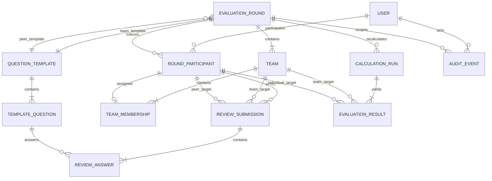

# AX 평가 시스템 데이터베이스 설계

| 항목 | 내용 |
|---|---|
| 문서 ID | AX-DB-001 |
| 버전 | 1.4 |
| 기준일 | 2026-08-15 |
| DBMS / ORM | PostgreSQL / Django 5.2 ORM |
| 기준 요구사항 | `REFINED-REQUIREMENTS.md` |
| 범위 | MVP 핵심 평가 기능 |

## 1. 설계 결론

MVP 업무 테이블은 **12개**로 제한한다. Django가 생성하는 auth, `django_session`,
contenttypes, admin 테이블은 이 수에 포함하지 않는다. 기본 DB 세션 엔진을 사용하므로 Google
로그인 중의 단기 `state`·`nonce`와 로그인 후 세션은 `django_session`에 저장된다.

이번 축소 설계의 기준은 다음과 같다.

1. 과제 안내, 파일 업로드, 팀 결과물 제출은 MVP에서 제외하므로 관련 테이블을 만들지 않는다.
2. 팀 편성은 `Team`과 `TeamMembership`의 현재 초안만 저장한다.
3. 자동편성은 별도 데이터 상태가 아니라 팀 편집 화면의 초기 배치 기능이다.
4. 자동 배치 후 튜터가 같은 화면에서 자유롭게 이동시키고 저장하므로 `formation_method`,
   `formation_status`, 후보·버전 테이블을 두지 않는다.
5. 팀·개인 평가 문항은 재사용 가능한 `QuestionTemplate`에 귀속하고 회차는 유형별
   템플릿을 하나씩 참조한다. 사용된 템플릿을 바꿀 때는 in-place 수정 대신 복제한다.
6. 재채점 이력만 `CalculationRun`으로 보존한다. 공개 설정은 해당 실행에 컬럼으로 둔다.
7. 다음 편성용 시드는 최근 활성 개인 결과에서 조회 시 계산하며 별도 시드 테이블에 저장하지
   않는다.
8. 팀 평가와 개인 평가는 대상 유형만 다르므로 하나의 제출·답변 테이블을 사용한다.
9. 팀 결과와 개인 결과도 대상 유형만 다른 하나의 결과 테이블로 저장한다.
10. Google 로그인은 단일 제공자·로그인 전용으로 제한하고 불변 `sub`만 User에 연결한다.
    ID/access/refresh token은 업무 DB에 저장하지 않는다.

## 2. 테이블 구성

| 앱 | 테이블 | 책임 |
|---|---|---|
| `accounts` | `accounts_user` | 로그인, 역할, 학생 식별 정보 |
| `rounds` | `rounds_evaluation_round` | 회차와 평가 기간·상태 |
|  | `rounds_round_participant` | 회차 참가자 스냅샷 |
|  | `rounds_question_template` | 재사용 가능한 TEAM·PEER 질문지 템플릿 |
|  | `rounds_template_question` | 평가 템플릿에 포함된 문항 |
| `teams` | `teams_team` | 회차의 팀 |
|  | `teams_team_membership` | 팀과 회차 참가자 관계 |
| `reviews` 신규 | `reviews_submission` | 팀·개인 평가 제출 |
|  | `reviews_answer` | 공통 평가 문항 답변 |
| `results` | `results_calculation_run` | 채점 실행·활성 버전·공개 범위 |
|  | `results_evaluation_result` | 팀·개인 대상의 점수·순위·완결성 |
| `audit` | `audit_event` | 중요 운영 작업의 추가 전용 기록 |

```text
accounts 1 + rounds 4 + teams 2 + reviews 2 + results 2 + audit 1 = 12개
```

## 3. 관계 모델



### 3.1 질문 템플릿 저장 경로

| 요구 개념 | 저장 위치 | 비고 |
|---|---|---|
| 재사용 질문지 템플릿 | `rounds_question_template` | TEAM·PEER category로 구분 |
| 템플릿의 개별 문항 | `rounds_template_question.template_id` | 회차 FK 없음 |
| 회차의 TEAM 템플릿 선택 | `rounds_evaluation_round.team_template_id` | TEAM category만 허용 |
| 회차의 PEER 템플릿 선택 | `rounds_evaluation_round.peer_template_id` | PEER category만 허용 |
| 제출한 문항별 답변 | `reviews_answer.question_id` | `rounds_template_question(id)` 참조 |

따라서 회차별 직접 질문 테이블은 존재하지 않는다. 튜터의 회차 저장 요청도 템플릿 FK 두
개만 받으며, 문항 배열이나 문항 변경값은 받지 않는다.

## 4. 공통 규칙

| 용도 | PostgreSQL | Django |
|---|---|---|
| PK | `bigint generated by default as identity` | `BigAutoField` |
| 시각 | `timestamptz` | `DateTimeField`, `USE_TZ=True` |
| 계산 점수 | `numeric(9,6)` | `DecimalField(9, 6)` |
| 표시 점수 | `numeric(4,2)` | `DecimalField(4, 2)` |
| 비율 | `numeric(7,6)` | `DecimalField(7, 6)` |
| 상태·유형 | 짧은 `varchar` + CHECK | `TextChoices` + `CheckConstraint` |
| 감사 상세 | `jsonb` | `JSONField` |

- 시각은 UTC로 저장하고 화면에서 `Asia/Seoul`로 변환한다.
- 점수 계산은 `Decimal`만 사용하고 표시값은 `ROUND_HALF_UP`으로 반올림한다.
- 시작된 회차의 참가자·팀·문항·평가·결과는 하드 삭제하지 않는다.
- 업무 FK는 기본적으로 `PROTECT`를 사용한다. 답변은 부모 제출 삭제 시에만 `CASCADE`하되,
  제출 자체를 운영 화면에서 삭제할 수 없게 한다.

### 4.1 Django 로그인 세션

Google token과 서비스 로그인 세션은 별개다. 인증 성공 후 `django.contrib.auth.login()`이
사용자 ID를 서버 세션에 기록하고 session key를 회전한다.

| 저장 위치 | 값 | 수명 |
|---|---|---|
| `django_session` | 인코딩된 사용자 인증 세션, `expire_date` | 로그인 성공 후 14일 |
| 브라우저 `sessionid` cookie | 무작위 session key만 저장 | 14일, 브라우저 종료 후에도 유지 |
| 로그인 전 `django_session` | Google `state`, `nonce`, 발급 시각 | 최대 5분, callback에서 일회성 삭제 |

운영 설정 기준선:

```python
SESSION_ENGINE = "django.contrib.sessions.backends.db"
SESSION_COOKIE_AGE = 60 * 60 * 24 * 14
SESSION_EXPIRE_AT_BROWSER_CLOSE = False
SESSION_SAVE_EVERY_REQUEST = False
SESSION_COOKIE_SECURE = True
SESSION_COOKIE_HTTPONLY = True
SESSION_COOKIE_SAMESITE = "Lax"
```

따라서 같은 브라우저에서 페이지나 브라우저를 닫았다 다시 열어도 14일 안에는 로그인 상태가
유지된다. 명시적 로그아웃은 cookie와 서버 세션을 삭제한다. 만료 세션 행은 매일
`manage.py clearsessions`로 정리한다.

## 5. 테이블 상세

### 5.1 `accounts_user`

프로젝트 시작부터 `AUTH_USER_MODEL = "accounts.User"`를 사용한다. 학생 프로필을 별도
테이블로 나누지 않고 사용자에 포함한다.

| 컬럼 | 타입 | Null | 규칙 |
|---|---|---|---|
| `id` | bigint PK | N |  |
| `username` | varchar(150) | N | UNIQUE |
| `email` | varchar(254) | N | 소문자 정규화, `UNIQUE(lower(email))` |
| `role` | varchar(16) | N | `STUDENT`, `TUTOR` |
| `student_number` | varchar(32) | Y | 학생이면 필수, UNIQUE |
| `display_name` | varchar(100) | N | 화면 표시 이름 |
| `google_sub` | varchar(255) | Y | Google 불변 subject, partial UNIQUE |
| `google_linked_at` | timestamptz | Y | 최초 연결 시각 |
| `is_active` | boolean | N | false면 로그인 거부 |
| `is_staff`, `is_superuser` | boolean | N | Django 권한 |
| `password` | varchar(128) | N | Django 해시 |
| `last_login` | timestamptz | Y |  |
| `date_joined` | timestamptz | N |  |

CHECK:

- `role='STUDENT'`이면 `student_number IS NOT NULL`; 튜터는 `student_number IS NULL`
- `google_sub`와 `google_linked_at`은 둘 다 null이거나 둘 다 non-null

`google_sub`는 Google ID Token의 `sub` claim을 그대로 저장하며 이메일을 외부 식별자로
사용하지 않는다. 계정은 삭제 대신 `is_active=False`로 비활성화한다.

#### Google 로그인 토큰 수명주기

```text
1. 시작 요청
   → cryptographic state·nonce 생성
   → Django server-side session에 5분 TTL로 저장
2. Google redirect
   → authorization code flow, scope=openid email profile, access_type=online
3. callback
   → state 일치·일회성 확인 후 즉시 session에서 제거
   → backend가 authorization code를 Google token endpoint에서 교환
4. ID Token 검증
   → signature/JWKS, iss, aud, exp, nonce, email_verified=true 검증
5. 계정 연결 또는 로그인
   → google_sub 기존 연결 우선 조회
   → 미연결이면 verified email과 같은 사전 등록 active User를 row lock 후 연결
   → 알 수 없는 email, 다른 sub가 연결된 계정, 비활성 계정은 거부
6. Django login
   → session key rotation 후 user_id를 django_session에 저장
   → OAuth 임시 만료(5분)를 로그인 세션 만료(14일)로 교체
7. 폐기
   → authorization code, ID Token, access token을 메모리에서 폐기
   → refresh token은 요청하지도 저장하지도 않음
```

브라우저의 localStorage·sessionStorage·일반 쿠키에는 Google token을 저장하지 않는다. 로그에도
authorization code와 token 원문을 남기지 않는다. OAuth client secret은 환경변수 또는 배포
환경의 secret manager에 저장하고 DB에는 넣지 않는다.

이 기준선은 Google API를 호출하지 않는 **로그인 전용** 설계다. 향후 Drive·Calendar 같은
Google API의 offline 접근이 필요해지면 그때 `accounts_google_credential`을 추가하고,
`user_id UNIQUE`, 암호화한 `refresh_token`, `granted_scopes`, `key_version`, `revoked_at`,
`updated_at`만 저장한다. refresh token은 KMS 기반 envelope encryption을 적용하고 access
token은 짧은 TTL cache에서만 관리한다. 이 확장 없이 refresh token을 User나 로그에 저장하는
것은 금지한다.

### 5.2 `rounds_evaluation_round`

| 컬럼 | 타입 | Null | 규칙 |
|---|---|---|---|
| `id` | bigint PK | N |  |
| `title` | varchar(150) | N |  |
| `description` | text | N | 기본값 빈 문자열 |
| `status` | varchar(20) | N | `DRAFT`, `IN_PROGRESS`, `COMPLETED` |
| `evaluation_start_at` | timestamptz | N |  |
| `evaluation_end_at` | timestamptz | N |  |
| `target_team_count` | smallint | N | 2 이상 |
| `team_template_id` | FK → `rounds_question_template(id)` | Y | 시작 전 필수, category=`TEAM`, PROTECT |
| `peer_template_id` | FK → `rounds_question_template(id)` | Y | 시작 전 필수, category=`PEER`, PROTECT |
| `lock_version` | integer | N | 초안 동시 수정 검사, 기본 0 |
| `created_by_id` | FK → user | N | PROTECT |
| `started_at` | timestamptz | Y | 실제 시작 시각 |
| `completed_at` | timestamptz | Y | 실제 마감 시각 |
| `created_at`, `updated_at` | timestamptz | N |  |

DB 제약:

- `evaluation_start_at < evaluation_end_at`
- `target_team_count >= 2`
- `status='DRAFT'`이면 `started_at`, `completed_at` 모두 null
- `status='IN_PROGRESS'`이면 `started_at`만 non-null
- `status='COMPLETED'`이면 둘 다 non-null이고 `started_at <= completed_at`
- partial unique index로 `status='IN_PROGRESS'` 회차를 시스템 전체에서 최대 한 개로 제한

### 5.3 `rounds_round_participant`

| 컬럼 | 타입 | Null | 규칙 |
|---|---|---|---|
| `id` | bigint PK | N |  |
| `round_id` | FK → evaluation_round | N | PROTECT |
| `user_id` | FK → user | N | PROTECT, 학생만 허용 |
| `student_number_snapshot` | varchar(32) | N | 시작 당시 값 보존 |
| `display_name_snapshot` | varchar(100) | N | 시작 당시 값 보존 |
| `created_at` | timestamptz | N |  |

제약: `UNIQUE(round_id, user_id)`, `UNIQUE(round_id, student_number_snapshot)`.
사용자의 현재 이름·활성 상태가 과거 회차의 기대 제출 수와 표시에 영향을 주지 않게 한다.

### 5.4 `rounds_question_template`

하나의 행이 하나의 재사용 가능한 질문지 템플릿이다. TEAM 질문지와 PEER 질문지는 같은
구조를 사용하되 `category`로 용도를 구분한다. 회차에는 질문을 직접 저장하지 않고 이
테이블의 행 두 개를 `team_template_id`, `peer_template_id`로 연결한다.

| 컬럼 | 타입 | Null | 규칙 |
|---|---|---|---|
| `id` | bigint PK | N |  |
| `name` | varchar(100) | N |  |
| `description` | varchar(500) | N | 기본값 빈 문자열 |
| `category` | varchar(8) | N | `TEAM`, `PEER` |
| `copied_from_id` | self FK → `rounds_question_template(id)` | Y | 복제 원본, PROTECT |
| `created_by_id` | FK → `accounts_user(id)` | N | Django staff 운영 관리자, PROTECT |
| `created_at`, `updated_at` | timestamptz | N |  |

DB 제약:

- `category IN ('TEAM', 'PEER')`
- `btrim(name) <> ''`
- `copied_from_id IS NULL OR copied_from_id <> id`
- 검색 인덱스: `(category, lower(name))`

템플릿은 여러 회차가 재사용할 수 있다. `IN_PROGRESS` 또는 `COMPLETED` 회차가 한 번이라도
참조한 템플릿과 그 문항은 수정·삭제하지 않는다. 내용 변경이 필요하면 staff 운영 관리자가
템플릿과 문항 전체를 복제한 새 템플릿을 등록하고, 튜터가 DRAFT 회차의 FK를 새 템플릿으로
바꾼다. 별도 status나 revision 테이블 없이 불변성과 변경 이력을 보존한다.

### 5.5 `rounds_template_question`

하나의 행이 질문 템플릿 안의 실제 문항 하나다. 회차별 직접 문항 테이블이 아니므로
`round_id`를 갖지 않으며 반드시 `template_id`를 통해
`rounds_question_template`에 귀속된다. Django staff 운영 관리자가 질문 템플릿 마스터를
등록할 때 문항을 추가·수정·삭제·정렬한다. 튜터의 회차 편집 서비스에는 문항 쓰기 경로를
제공하지 않는다.

| 컬럼 | 타입 | Null | 규칙 |
|---|---|---|---|
| `id` | bigint PK | N |  |
| `template_id` | FK → `rounds_question_template(id)` | N | PROTECT |
| `response_type` | varchar(12) | N | `RATING_5`, `TEXT` |
| `prompt` | varchar(500) | N | 공백 불가 |
| `is_required` | boolean | N | 기본 true |
| `display_order` | smallint | N | 1 이상 |
| `created_at`, `updated_at` | timestamptz | N |  |

DB 제약:

- `response_type IN ('RATING_5', 'TEXT')`
- `btrim(prompt) <> ''`
- `display_order >= 1`
- `UNIQUE(template_id, display_order)`

각 템플릿에는 채점 가능한 `RATING_5` 문항이 하나 이상 필요하다. 이는 다른 행을 집계해야
하므로 회차 시작 서비스가 검증한다. 템플릿의 `category`가 문항과 평가 제출의 TEAM/PEER
범위를 결정하며 문항에는 중복 category나 round FK를 두지 않는다.

### 5.6 `teams_team`

| 컬럼 | 타입 | Null | 규칙 |
|---|---|---|---|
| `id` | bigint PK | N |  |
| `round_id` | FK → evaluation_round | N | PROTECT |
| `team_number` | smallint | N | 1 이상 |
| `name` | varchar(100) | N | 기본값은 `N팀` |
| `created_at`, `updated_at` | timestamptz | N |  |

제약: `UNIQUE(round_id, team_number)`.

`method`, `status`, `formation_id` 컬럼은 두지 않는다. DRAFT 회차의 팀 행 자체가 편집 중인
유일한 구성이고, 회차 시작 시 같은 행들이 불변이 된다.

### 5.7 `teams_team_membership`

| 컬럼 | 타입 | Null | 규칙 |
|---|---|---|---|
| `id` | bigint PK | N |  |
| `team_id` | FK → team | N | PROTECT |
| `participant_id` | FK → round_participant | N | UNIQUE, PROTECT |
| `created_at` | timestamptz | N |  |

`participant_id`의 UNIQUE로 한 참가자가 한 회차에서 둘 이상의 팀에 속하지 못한다. 팀과
참가자의 회차 일치는 저장 서비스에서 검사한다. 시작 서비스는 모든 참가자가 정확히 한 팀에
배정되고 빈 팀이 없음을 다시 검사한다.

### 5.8 `reviews_submission`

팀 평가와 개인 평가는 같은 제출 생명주기를 사용한다. `review_type`과 대상 FK의 조합만 다르다.

| 컬럼 | 타입 | Null | 규칙 |
|---|---|---|---|
| `id` | bigint PK | N |  |
| `round_id` | FK → evaluation_round | N | PROTECT |
| `review_type` | varchar(8) | N | `TEAM`, `PEER` |
| `evaluator_id` | FK → round_participant | N | PROTECT |
| `target_team_id` | FK → team | Y | TEAM일 때만 값 존재 |
| `target_participant_id` | FK → round_participant | Y | PEER일 때만 값 존재 |
| `submitted_at` | timestamptz | N | 서버 시각 |

CHECK:

```text
(review_type='TEAM' AND target_team_id IS NOT NULL AND target_participant_id IS NULL)
OR
(review_type='PEER' AND target_team_id IS NULL AND target_participant_id IS NOT NULL)
```

partial unique index:

- TEAM: `(round_id, evaluator_id, target_team_id) WHERE review_type='TEAM'`
- PEER: `(round_id, evaluator_id, target_participant_id) WHERE review_type='PEER'`

PEER이면 `evaluator_id <> target_participant_id`를 CHECK한다. 본인 팀 제외와 같은 팀원 여부,
모든 FK의 회차 일치는 제출 서비스에서 검사한다. 제출 후 수정·삭제하지 않는다.

### 5.9 `reviews_answer`

| 컬럼 | 타입 | Null | 규칙 |
|---|---|---|---|
| `id` | bigint PK | N |  |
| `submission_id` | FK → reviews_submission | N | CASCADE |
| `question_id` | FK → `rounds_template_question(id)` | N | PROTECT |
| `rating_value` | smallint | Y | 1~5 |
| `text_value` | text | Y | 최대 2,000자 |
| `created_at` | timestamptz | N | 서버 시각 |

DB 제약:

- `UNIQUE(submission_id, question_id)`
- `rating_value`와 `text_value` 중 정확히 하나만 non-null
- `rating_value IS NULL OR rating_value BETWEEN 1 AND 5`
- `text_value IS NULL OR char_length(text_value) <= 2000`

`question_id`가 제출 회차에서 선택한 `review_type` 대응 질문 템플릿의 문항인지, 값이 해당
문항의 `response_type`과 일치하는지는 제출 서비스가 트랜잭션 안에서 검사한다.

### 5.10 `results_calculation_run`

| 컬럼 | 타입 | Null | 규칙 |
|---|---|---|---|
| `id` | bigint PK | N |  |
| `round_id` | FK → evaluation_round | N | PROTECT |
| `version` | integer | N | 회차 안에서 1부터 증가 |
| `status` | varchar(12) | N | `RUNNING`, `SUCCEEDED`, `FAILED` |
| `is_active` | boolean | N | 성공한 학생 노출 기준 버전 |
| `formula_version` | varchar(32) | N | 예: `score-v1` |
| `input_digest` | char(64) | Y | 유효 제출 ID·값의 SHA-256 |
| `executed_by_id` | FK → user | N | PROTECT |
| `started_at` | timestamptz | N |  |
| `finished_at` | timestamptz | Y |  |
| `error_summary` | text | N | 기본값 빈 문자열 |
| `winner_published_at` | timestamptz | Y | 팀 1위 공개 |
| `team_ranking_published_at` | timestamptz | Y | 전체 팀 순위 공개 |
| `my_score_published_at` | timestamptz | Y | 본인 최종·구성 점수 공개 |
| `peer_ranking_published_at` | timestamptz | Y | 본인 개인 순위 공개 |

제약:

- `UNIQUE(round_id, version)`
- partial unique index로 `is_active=true` 실행을 회차당 최대 하나로 제한
- `is_active=true`이면 `status='SUCCEEDED'`
- 공개 시각은 `status='SUCCEEDED' AND is_active=true`일 때만 설정 가능

새 실행은 비활성·비공개로 계산한다. 성공한 트랜잭션의 마지막 단계에서 기존 실행을
비활성화하고 새 실행을 활성화한다. 실패하면 기존 활성 결과와 공개 상태를 유지한다.

### 5.11 `results_evaluation_result`

팀 결과와 개인 결과는 하나의 테이블에 저장한다. `result_type`에 따라 대상과 사용 컬럼을
제한한다.

| 컬럼 | 타입 | Null | 규칙 |
|---|---|---|---|
| `id` | bigint PK | N |  |
| `calculation_run_id` | FK → calculation_run | N | PROTECT |
| `result_type` | varchar(12) | N | `TEAM`, `INDIVIDUAL` |
| `team_id` | FK → team | Y | TEAM일 때만 값 존재 |
| `participant_id` | FK → round_participant | Y | INDIVIDUAL일 때만 값 존재 |
| `team_score_raw` | numeric(9,6) | Y | TEAM 점수 또는 개인의 소속 팀 점수 |
| `peer_score_raw` | numeric(9,6) | Y | INDIVIDUAL만 사용 |
| `final_score_raw` | numeric(9,6) | Y | INDIVIDUAL만 사용, 40:60 합산 |
| `display_score` | numeric(4,2) | Y | TEAM 점수 또는 개인 최종점수 표시값 |
| `primary_rank` | integer | Y | TEAM 순위 또는 개인 최종순위 |
| `peer_rank` | integer | Y | INDIVIDUAL 개인점수 순위 |
| `expected_count` | integer | N | TEAM이면 팀 평가, INDIVIDUAL이면 개인 평가 기대 수 |
| `valid_count` | integer | N | 0 이상, expected 이하 |
| `coverage` | numeric(7,6) | Y | expected가 0이면 null |
| `data_status` | varchar(16) | N | `NOT_APPLICABLE`, `COMPLETE`, `PARTIAL`, `NO_DATA` |

대상 CHECK:

```text
(result_type='TEAM' AND team_id IS NOT NULL AND participant_id IS NULL)
OR
(result_type='INDIVIDUAL' AND team_id IS NULL AND participant_id IS NOT NULL)
```

partial unique index:

- TEAM: `(calculation_run_id, team_id) WHERE result_type='TEAM'`
- INDIVIDUAL: `(calculation_run_id, participant_id) WHERE result_type='INDIVIDUAL'`

TEAM 행은 `peer_score_raw`, `final_score_raw`, `peer_rank`가 null이어야 한다. INDIVIDUAL 행은
팀 점수나 개인 점수 중 하나가 N/A이면 `final_score_raw`, `display_score`, `primary_rank`가
null이어야 한다. `NO_DATA`와 `NOT_APPLICABLE`의 대상 점수·순위도 null로 강제한다. 이
nullable 컬럼은 임의 선택 필드가 아니라 `result_type` CHECK로 조합이 제한되는 단일 테이블
상속 패턴이다.

### 5.12 `audit_event`

| 컬럼 | 타입 | Null | 규칙 |
|---|---|---|---|
| `id` | bigint PK | N |  |
| `round_id` | FK → evaluation_round | Y | PROTECT |
| `actor_id` | FK → user | Y | 시스템 작업이면 null |
| `action` | varchar(64) | N | 허용 action 목록 CHECK |
| `target_type` | varchar(64) | N | 도메인 객체 유형 |
| `target_id` | varchar(64) | N | 논리 식별자 |
| `result` | varchar(12) | N | `SUCCEEDED`, `FAILED` |
| `summary` | jsonb | N | 변경 요약, 민감 원문 금지 |
| `request_id` | uuid | Y | 요청 추적 |
| `created_at` | timestamptz | N | 서버 시각 |

이 테이블은 update/delete 경로를 제공하지 않는다. `ROUND_STARTED`,
`ROUND_FORCE_COMPLETED`, `TEAM_CONFIGURATION_SAVED`, `CALCULATION_SUCCEEDED`,
`CALCULATION_FAILED`, `PUBLICATION_CHANGED`, `GOOGLE_ACCOUNT_LINKED`,
`GOOGLE_LOGIN_REJECTED`를 허용 action의 기준선으로 삼는다. 로그인 감사에는 token·code·
nonce·state 원문을 넣지 않는다. 자동 배치 여부나 수동 수정 여부도 기록하지 않는다.

## 6. 핵심 인덱스와 제약

| 테이블 | 인덱스 | 목적 |
|---|---|---|
| user | `lower(email)` UNIQUE, `(google_sub) WHERE google_sub IS NOT NULL` UNIQUE | 계정 연결·Google 식별 |
| evaluation_round | `(status) WHERE status='IN_PROGRESS'` UNIQUE | 현재 회차 단일성 |
| round_participant | `(round_id, user_id)` UNIQUE | 회차 참가 조회 |
| rounds_question_template | `(category, lower(name))` | 유형별 질문 템플릿 검색 |
| rounds_template_question | `(template_id, display_order)` UNIQUE | 템플릿 문항 순서 |
| team | `(round_id, team_number)` UNIQUE | 팀 조회 |
| team_membership | `(participant_id)` UNIQUE, `(team_id)` | 한 팀 배정·팀원 조회 |
| review_submission | TEAM/PEER별 대상 partial UNIQUE | 중복 제출 차단 |
| review_answer | `(submission_id, question_id)` UNIQUE | 중복 답변 차단 |
| calculation_run | `(round_id, version)` UNIQUE, `(round_id) WHERE is_active` UNIQUE | 결과 버전 |
| evaluation_result | TEAM/INDIVIDUAL별 대상 partial UNIQUE | 결과·시드 조회 |
| audit_event | `(round_id, created_at)`, `(actor_id, created_at)` | 감사 조회 |

```sql
CREATE UNIQUE INDEX uq_single_in_progress_round
ON rounds_evaluation_round (status)
WHERE status = 'IN_PROGRESS';

CREATE UNIQUE INDEX uq_user_email_ci
ON accounts_user (lower(email));

CREATE UNIQUE INDEX uq_user_google_sub
ON accounts_user (google_sub)
WHERE google_sub IS NOT NULL;

CREATE UNIQUE INDEX uq_active_calculation_per_round
ON results_calculation_run (round_id)
WHERE is_active = TRUE;

CREATE UNIQUE INDEX uq_team_review_target
ON reviews_submission (round_id, evaluator_id, target_team_id)
WHERE review_type = 'TEAM';

CREATE UNIQUE INDEX uq_peer_review_target
ON reviews_submission (round_id, evaluator_id, target_participant_id)
WHERE review_type = 'PEER';

ALTER TABLE rounds_question_template
ADD CONSTRAINT ck_question_template_category
CHECK (category IN ('TEAM', 'PEER'));

ALTER TABLE rounds_template_question
ADD CONSTRAINT ck_template_question_response_type
CHECK (response_type IN ('RATING_5', 'TEXT')),
ADD CONSTRAINT ck_template_question_display_order
CHECK (display_order >= 1),
ADD CONSTRAINT uq_template_question_order
UNIQUE (template_id, display_order);

ALTER TABLE reviews_answer
ADD CONSTRAINT ck_review_answer_one_value
CHECK ((rating_value IS NOT NULL) <> (text_value IS NOT NULL)),
ADD CONSTRAINT ck_review_answer_rating_range
CHECK (rating_value IS NULL OR rating_value BETWEEN 1 AND 5),
ADD CONSTRAINT ck_review_answer_text_length
CHECK (text_value IS NULL OR char_length(text_value) <= 2000);

CREATE UNIQUE INDEX uq_team_result_target
ON results_evaluation_result (calculation_run_id, team_id)
WHERE result_type = 'TEAM';

CREATE UNIQUE INDEX uq_individual_result_target
ON results_evaluation_result (calculation_run_id, participant_id)
WHERE result_type = 'INDIVIDUAL';
```

## 7. DB 제약과 서비스 검증의 경계

DB에서 강제할 규칙:

- 단일 컬럼 범위와 상태값
- 동일 부모 아래 순번과 제출의 유일성
- 한 참가자의 팀 중복 배정 금지
- review_type별 대상 FK 조합과 자기 개인 평가 금지
- 회차당 활성 계산 버전과 현재 회차의 단일성
- result_type별 대상 FK 조합과 점수·카운트·N/A null 조합

트랜잭션 서비스에서 강제할 규칙:

- Google callback의 state·nonce 일회성, ID Token signature/iss/aud/exp/email_verified 검증
- google_sub 우선 식별, 사전 등록 active email만 최초 연결, 연결 충돌 거부
- 팀·참가자·문항·평가 대상의 회차 일치
- 본인 팀 평가 금지와 같은 팀원만 개인 평가 허용
- 회차 상태와 `evaluation_start_at <= now < evaluation_end_at`
- 필수 문항 전체 응답과 질문 유형별 값 검증
- DRAFT 외 참가자·팀·템플릿 연결 수정 금지, 시작된 회차가 참조한 템플릿·문항 수정 금지
- 시작 시 전원 배정, 빈 팀 없음, TEAM/PEER 템플릿 category 일치와 척도 문항 존재
- 마감·채점·공개의 허용 순서

교차 테이블 조건을 DB trigger로 숨기지 않고 명명된 도메인 서비스에서 검사해 테스트 가능성을
유지한다. 유일성·CHECK는 경쟁 요청의 최종 방어선으로 항상 둔다.

## 8. 핵심 트랜잭션

### 8.1 Google 로그인과 최초 연결

```text
callback
→ session의 state 일치·TTL 확인, state 일회성 소비
→ backend authorization code 교환
→ ID Token 전체 검증과 nonce 일치·일회성 소비
→ atomic
   → google_sub로 User 조회
   → 없으면 lower(verified email)로 active User SELECT FOR UPDATE
   → google_sub가 null이면 sub+linked_at 설정
   → 다른 sub가 있으면 충돌 거부
   → AuditEvent(GOOGLE_ACCOUNT_LINKED 또는 GOOGLE_LOGIN_REJECTED)
→ Django login()으로 session key rotation
→ token·code 폐기
```

이미 연결된 사용자는 이메일이 변경되어도 `google_sub`로 식별한다. token의 verified email이
저장 이메일과 달라졌다면 자동 수정하지 않고 관리자 확인 대상으로 기록한다. 미등록 사용자를
자동 생성하지 않는다.

### 8.2 팀 편성 저장

```text
atomic
→ EvaluationRound SELECT FOR UPDATE
→ DRAFT와 lock_version 확인
→ 화면이 보낸 팀/참가자 전체 집합 검증
→ 기존 DRAFT TeamMembership·Team 교체
→ Team·TeamMembership 일괄 생성
→ lock_version 증가
→ AuditEvent(TEAM_CONFIGURATION_SAVED)
→ commit
```

자동 배치는 이 트랜잭션 전에 서버가 제안 배열을 반환하는 계산일 뿐이다. 제안 배열을 수동으로
고쳐도 저장 절차와 데이터 모양은 완전히 같다.

### 8.3 회차 시작

```text
atomic
→ EvaluationRound SELECT FOR UPDATE
→ DRAFT와 기간 검증
→ 참가자·팀·팀원·TEAM/PEER 템플릿·문항 완결성 검증
→ 참가자 이름·식별번호 snapshot 확정
→ status=IN_PROGRESS, started_at=now
→ AuditEvent(ROUND_STARTED)
→ commit
```

### 8.4 평가 제출

```text
atomic
→ 회차·평가자·대상·문항 조회
→ 권한, 상태, 반개방 시간 경계, 대상 자격 검증
→ Submission 생성
→ Answer 일괄 생성
→ UNIQUE 충돌은 이미 제출한 대상으로 변환
→ commit
```

제출을 별도 `COMPLETED` 상태로 관리하지 않는다. Submission 행의 존재가 완료 상태다.

### 8.5 채점·재채점

```text
atomic phase 1: 비활성 RUNNING CalculationRun 생성
calculate: repeatable-read 입력 snapshot으로 결과 계산
atomic phase 2:
  → TEAM·INDIVIDUAL EvaluationResult 일괄 저장
  → input_digest와 SUCCEEDED 기록
  → 기존 run 비활성화, 새 run 활성화
  → 공개 시각은 null로 유지
  → AuditEvent(CALCULATION_SUCCEEDED)
```

오류면 새 실행만 FAILED로 남기고 기존 활성 실행과 공개 시각은 바꾸지 않는다.

## 9. 자동편성과 시드

자동편성에는 영속 상태가 없다.

1. 선택한 참가자의 최근 활성 `EvaluationResult(result_type=INDIVIDUAL).final_score_raw`를
   최대 3회 조회한다.
2. N/A는 제외하고 20:30:50 가중치를 가용 이력에 맞춰 재정규화한다.
3. 인원 균형과 점수 분산 완화 알고리즘으로 초기 배열을 만든다.
4. 배열을 팀 편집 화면에 반환한다.
5. 튜터는 학생을 이동·교환하거나 다시 자동 배치할 수 있다.
6. 최종 저장 시에는 결과 배열만 `Team`과 `TeamMembership`에 기록한다.

따라서 자동·수동을 구분하는 DB 컬럼, 후보 상태, 알고리즘 실행 이력은 없다. 알고리즘 버전은
코드와 배포 버전으로 관리한다.

## 10. 권한과 보존

| 데이터 | 학생 | 튜터 | Django staff 운영 관리자 |
|---|---|---|---|
| 사용자 | 본인 최소 정보 | 참가자 조회 | 계정·권한 관리 |
| 회차 | 참가 회차 읽기 | DRAFT 필드·템플릿 연결 편집, 시작 후 읽기 | 동일 |
| 질문 템플릿·문항 | 참가 회차가 참조한 내용 읽기 | 등록된 템플릿 조회·선택만 | 미사용 마스터 등록·편집, 사용 후 읽기 |
| 팀 | 본인 팀 읽기 | DRAFT 편집, 시작 후 읽기 | 동일 |
| 평가 제출 | 본인의 TEAM·PEER 작성분 읽기 | 전체 읽기 | 전체 읽기 |
| 결과 | 공개된 본인·팀 범위 | 전체·모든 계산 버전 읽기 | 전체·모든 계산 버전 읽기 |
| 감사 | 접근 불가 | 허가된 경우 읽기 | 허가된 경우 읽기 |

- 사용자·회차·질문·팀은 참조되기 전 DRAFT에서만 삭제할 수 있다.
- 제출·답변·계산 실행·결과·감사는 하드 삭제하지 않는다.
- 자유 서술 원문은 감사·운영 로그에 복제하지 않는다.
- 백업·보존 기간은 운영 정책 확정 후 별도 ADR로 정한다.

## 11. 마이그레이션 순서

```text
1. accounts.0001       User
2. settings            AUTH_USER_MODEL 지정
3. rounds.0001         EvaluationRound, RoundParticipant, QuestionTemplate, TemplateQuestion
4. teams.0001          Team, TeamMembership
5. reviews.0001        ReviewSubmission, ReviewAnswer
6. results.0001        CalculationRun, EvaluationResult
7. audit.0001          AuditEvent
8. constraints         partial unique와 복합 CHECK 추가
```

현재 저장된 업무 데이터와 앱 마이그레이션이 없으므로 기존 데이터 변환은 필요하지 않다.
현재의 빈 `team_reviews`, `peer_reviews` 골격 앱은 구현 전에 `INSTALLED_APPS`에서 제거하고
공통 `reviews` 앱으로 교체한다. `django.contrib.sessions`의 `django_session` migration은
Google OAuth 임시 상태와 로그인 세션 저장을 위해 유지한다.

## 12. 2단계 설계 리뷰

### 12.1 1차 — 범위와 최소성

| 발견 | 판단 | 반영 |
|---|---|---|
| 과제·파일 관련 6개 테이블 | MVP 외 범위 | 전체 제거 |
| TeamFormation 방식·상태·버전 | 최종 팀 구성으로부터 평가 자격을 판정하는 데 불필요 | 제거, Team·Membership만 유지 |
| 회차별 Question 테이블 | 질문은 회차가 아니라 재사용 템플릿에 속함 | 만들지 않고 QuestionTemplate·TemplateQuestion을 마스터로 유지 |
| TemplateRevision 별도 테이블 | 불변 템플릿 자체를 복제하면 같은 목적 달성 | QuestionTemplate·TemplateQuestion만 두고 copied_from으로 계보 추적 |
| StudentProfile 1:1 분리 | 현재 학생 전용 속성이 2개뿐임 | User에 병합 |
| PublicationSetting | CalculationRun과 항상 1:1 | 공개 시각 4개를 run에 병합 |
| SeedRun·Value·Contribution | 활성 결과에서 계산 가능한 파생값 | 영속화하지 않고 조회 시 계산 |
| 팀/개인 Submission·Answer 분리 | 유형 외 생명주기와 컬럼이 동일 | review_type과 nullable 대상 FK로 통합 |
| TeamResult·IndividualResult 분리 | 대상 유형 외 계산 실행·완결성 구조가 동일 | result_type 기반 EvaluationResult로 통합 |
| Google 단일 로그인에 범용 SocialAccount·Token 테이블 | 로그인 외 API 권한을 쓰지 않아 과도함 | User에 google_sub 연결, token 비영속화 |

1차 결론: 각 테이블이 MVP의 독립적인 생명주기나 다중 관계를 표현하며, 단순 1:1 설정과
파생 데이터는 별도 테이블로 만들지 않았다.

### 12.2 2차 — 무결성, 동시성, 운영

| 위험 | 방어 |
|---|---|
| 두 튜터의 DRAFT 팀 구성 덮어쓰기 | round row lock + `lock_version` |
| 참가자 누락·중복·다른 회차 연결 | DB UNIQUE + 저장 서비스의 전체 집합 검증 |
| 같은 대상 중복 평가 | 제출 복합 UNIQUE + 원자적 Submission/Answer 저장 |
| 공통 테이블에서 TEAM·PEER 대상이 동시에 설정됨 | review_type별 정확히 하나의 대상 FK CHECK |
| 시작 후 평가 기준 변경 | 참가자·팀·문항 수정 차단 + 보호 FK |
| 재채점 실패로 공개 결과 손상 | 새 비활성 run 계산 후 성공 시에만 활성 교체 |
| 비활성 결과의 오공개 | active/succeeded 조건 CHECK와 공개 서비스 검증 |
| 결측을 0점으로 오인 | N/A 상태의 점수·순위 null CHECK |
| 공통 결과에서 팀·개인 대상 또는 컬럼 조합이 섞임 | result_type별 대상·컬럼 CHECK + partial UNIQUE |
| OAuth callback 위조·재사용 | session의 5분 state·nonce를 일회성 소비하고 ID Token 전체 검증 |
| token·code가 DB·브라우저·로그에 잔존 | backend 메모리에서만 처리 후 폐기, refresh token 미요청 |
| verified email이 기존 다른 Google 계정에 연결 | google_sub partial UNIQUE + row lock + 충돌 거부 |
| 튜터가 회차 화면에서 문항을 임의 변경 | 회차에는 템플릿 FK만 저장하고 문항 쓰기는 staff 전용 템플릿 관리 서비스로 제한 |

2차 결론: DB가 가능한 로컬 제약을 맡고, 회차 일치·대상 자격처럼 여러 행을 읽어야 하는
조건은 잠금이 포함된 도메인 서비스가 맡는다. 구현 전 논리 설계로 승인한다.

## 13. 구현 전 검증 체크리스트

- [x] MVP 범위를 12개 업무 테이블로 설명할 수 있다.
- [x] 과제·파일·제출 테이블이 MVP에서 제외되었다.
- [x] 팀 편성 방식·상태·후보 이력을 저장하지 않는다.
- [x] 자동 배치 후 같은 편집기에서 수동 조정하는 흐름이다.
- [x] 회차는 TEAM·PEER 템플릿을 하나씩 지정하고 문항은 템플릿에 귀속된다.
- [x] 튜터는 회차에서 등록된 템플릿만 선택하며 개별 문항을 변경하지 않는다.
- [x] 팀·개인 제출과 답변은 공통 reviews 테이블을 사용한다.
- [x] 팀·개인 결과는 공통 EvaluationResult 테이블을 사용한다.
- [x] 평가 중복은 DB UNIQUE와 서비스 검증으로 이중 차단된다.
- [x] 재채점 실패가 기존 공개 결과를 훼손하지 않는다.
- [x] 다음 편성 시드는 활성 결과에서 계산 가능하다.
- [x] Google 로그인은 불변 sub를 저장하고 email을 외부 식별자로 쓰지 않는다.
- [x] code·ID/access token은 검증 후 폐기하고 refresh token은 요청·저장하지 않는다.
- [x] state·nonce와 Django 로그인 세션의 저장 위치·TTL·일회성 정책이 정의되었다.
- [ ] 실제 Django model과 migration 구현 후 constraint 테스트를 통과한다.
