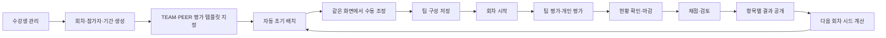
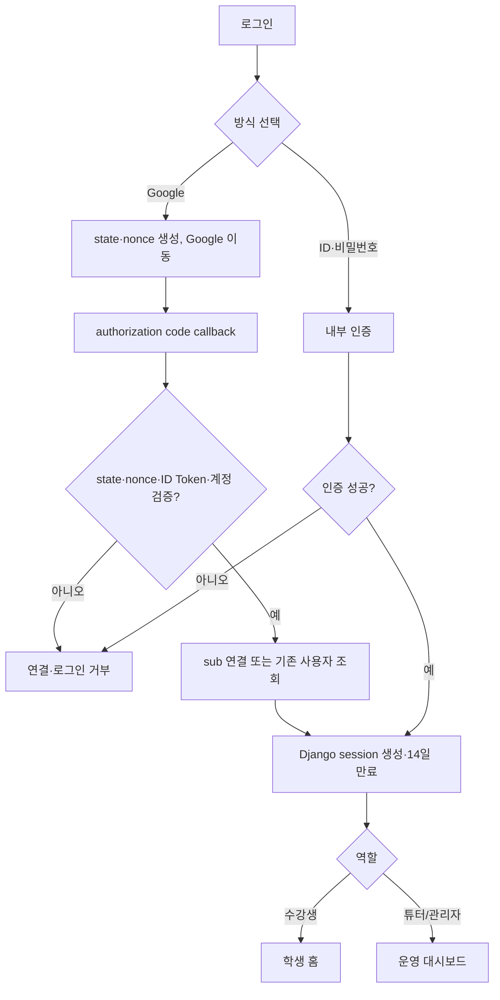
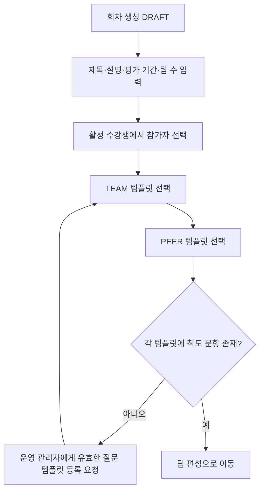
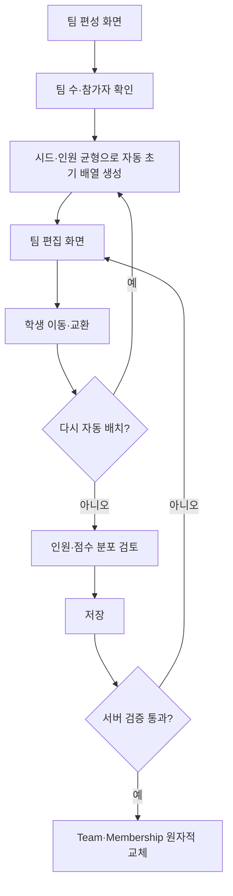
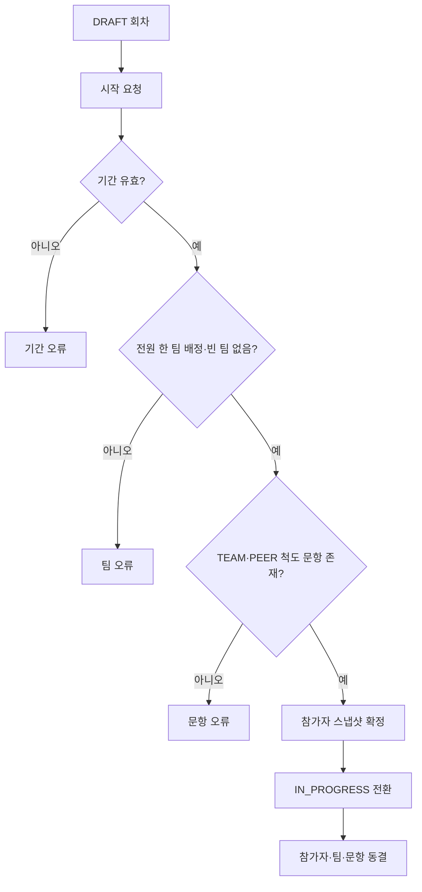
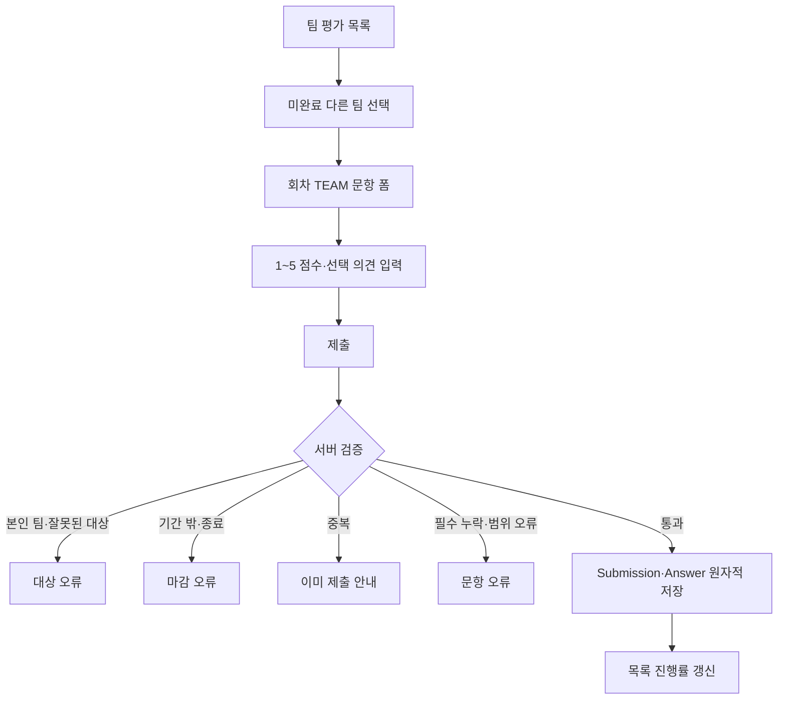
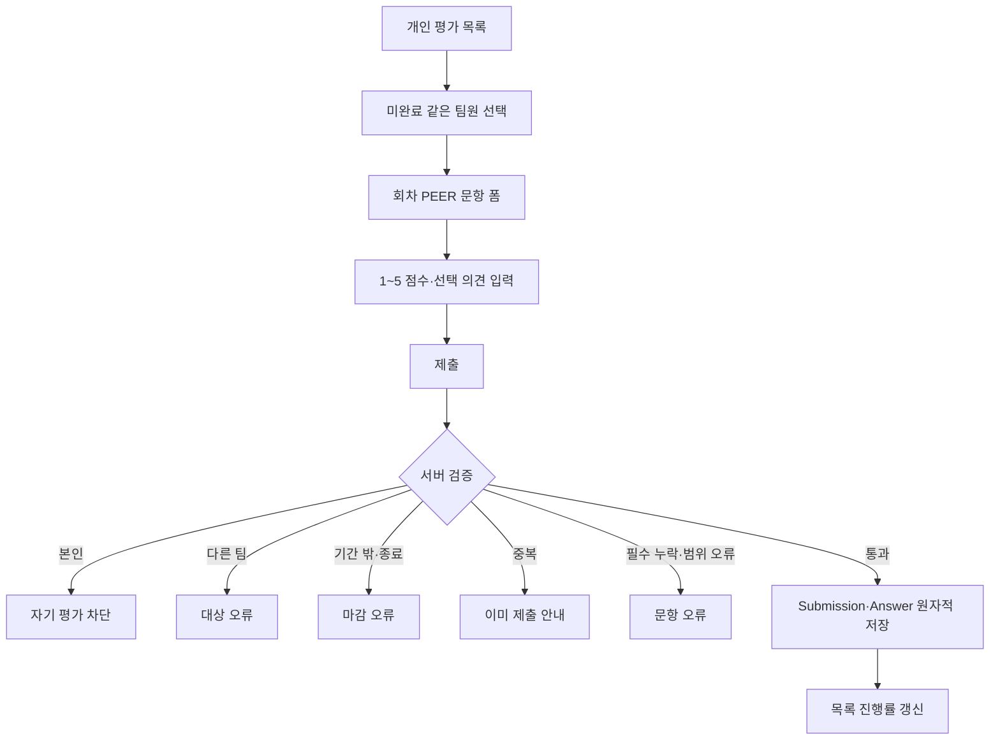
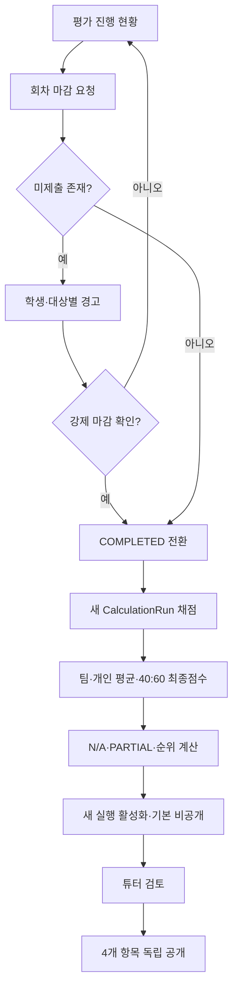
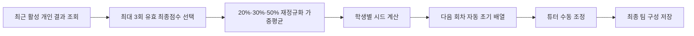

# AX 평가 시스템 기능 및 페이지 플로우

| 항목 | 내용 |
|---|---|
| 문서 버전 | 1.4 |
| 기준 문서 | `REFINED-REQUIREMENTS.md` v1.4 |
| 대상 | MVP 수강생·튜터/관리자 화면 |
| 제외 | 과제 자료·파일·링크 업로드와 팀 제출물 관리 |

## 1. 전체 운영 흐름



과제 수행과 발표는 시스템 밖에서 진행한다. MVP 시스템은 참가자·팀·평가·결과만 관리한다.

## 2. 역할별 내비게이션

```text
수강생
├─ 홈
├─ 내 팀
├─ 팀 평가
├─ 개인 평가
├─ 제출 현황
└─ 내 결과

튜터/관리자
├─ 운영 대시보드
├─ 수강생 관리
├─ 회차·질문 템플릿 선택
├─ 팀 편성
├─ 평가 진행·제출 현황
└─ 결과·공개·다음 팀 편성
```

## 3. 기능별 플로우

### 3.1 로그인과 역할 분기



- 모든 보호 GET·POST는 로그인과 역할을 서버에서 다시 검사한다.
- 역할이 없거나 비활성 계정이면 업무 화면에 진입시키지 않는다.
- 권한 없는 직접 URL은 데이터를 노출하거나 변경하지 않고 403 또는 404로 처리한다.
- Google code·ID/access token은 callback 처리 후 폐기하고 지속 로그인에는 사용하지 않는다.
- `sessionid`와 `django_session`은 14일 유지하므로 브라우저 재시작 후에도 로그인이 유지된다.
- 로그아웃은 현재 Django 세션을 삭제한다. Google 전체 계정에서 로그아웃시키지는 않는다.

### 3.2 회차 생성과 평가 템플릿 지정



- 문항 유형은 `1~5 척도형`과 `자유 서술형`이다.
- 튜터는 회차에서 사전 등록된 TEAM·PEER 질문 템플릿을 선택할 뿐 개별 문항을 편집하지 않는다.
- Django staff 운영 관리자는 Admin에서 미사용 질문 템플릿과 소속 문항을 등록한다.
- 이미 시작된 회차가 사용한 템플릿은 불변이며, 변경하려면 운영 관리자가 전체를 복제해 새 템플릿을 등록한다.
- 회차 시작 후 참가자·팀·템플릿 연결과 참조 문항은 읽기 전용이다.

### 3.3 통합 팀 편성



- 자동 배치는 별도 업무 상태가 아니라 편집 화면의 초기값 생성 기능이다.
- 자동 배치 직후 수동 조정할 수 있고, 두 경로는 같은 저장 버튼과 검증을 사용한다.
- DB에는 최종 `Team`과 `TeamMembership`만 저장한다. 자동·수동 구분, 후보 상태, 실행 이력은
  저장하지 않는다.
- 저장 전 배열은 학생 화면에 공개되지 않는다.
- 저장 시 대상 누락·중복, 빈 팀, 다른 회차 참가자, DRAFT 여부, `lock_version`을 재검증한다.
- 수동 조정 결과의 팀 인원 차이가 1명을 넘으면 경고 후 저장을 허용한다.

### 3.4 회차 시작



현재 `IN_PROGRESS` 회차가 이미 있으면 다른 회차 시작을 거부한다. 평가 제출은 회차 상태뿐
아니라 `evaluation_start_at <= now < evaluation_end_at`도 만족해야 한다.

### 3.5 팀 평가 제출



제출 행의 존재가 해당 대상의 완료 상태다. 제출 후 학생은 본인 작성 내용을 읽기 전용으로만
확인한다.

### 3.6 개인 평가 제출



팀에 본인만 있으면 `평가 대상 없음`을 정상 완료 상태로 표시한다. 다른 평가자의 응답과
작성자별 결과는 학생에게 노출하지 않는다.

팀 평가와 개인 평가는 화면·대상 검증은 분리하지만 저장 시에는 공통 `ReviewSubmission`과
`ReviewAnswer`를 사용하고 `review_type`으로 구분한다.

### 3.7 마감, 채점, 공개



- `evaluation_end_at`과 정확히 같은 시각의 제출은 저장하지 않는다.
- 미제출은 0점으로 채우지 않고 받은 유효 제출만 평균하며 커버리지를 함께 표시한다.
- 재채점은 새 계산 버전을 만든다. 성공 시에만 활성 버전을 바꾸고 모든 공개 항목을 끈다.
- 실패 시 기존 활성 결과와 공개 범위를 그대로 유지한다.
- 팀·개인 결과는 공통 `EvaluationResult`에 저장하고 `result_type`과 대상 FK로 구분한다.

### 3.8 다음 회차 시드와 자동 초기 배치



시드는 별도 테이블에 저장하지 않는다. N/A 이력은 제외하고 유효 이력이 없는 참가자는
무시드로 균등 배치한다.

## 4. 페이지 목록

| ID | 권장 경로 | 페이지 | 사용자 | 핵심 목적 |
|---|---|---|---|---|
| PG-01 | `/accounts/login/` | 로그인 | 공통 | 인증과 역할별 진입 |
| PG-02 | `/` | 역할별 홈 분기 | 공통 | 현재 해야 할 일 요약 |
| PG-03 | `/accounts/logout/` | 로그아웃 | 공통 | 세션 종료 |
| PG-10 | `/student/team/` | 내 팀 | 수강생 | 현재 팀과 팀원 조회 |
| PG-11 | `/reviews/teams/` | 팀 평가 목록 | 수강생 | 대상별 제출 상태와 진입 |
| PG-12 | `/reviews/teams/<team_id>/` | 팀 평가 폼 | 수강생 | 다른 팀 평가 제출·조회 |
| PG-13 | `/reviews/peers/` | 개인 평가 목록 | 수강생 | 팀원별 제출 상태와 진입 |
| PG-14 | `/reviews/peers/<participant_id>/` | 개인 평가 폼 | 수강생 | 같은 팀원 평가 제출·조회 |
| PG-15 | `/reviews/status/` | 제출 현황 | 수강생 | 팀·개인 평가 통합 진행률 |
| PG-16 | `/results/me/` | 내 결과 | 수강생 | 공개된 범위의 결과 조회 |
| PG-20 | `/admin/` | Django Admin | staff 운영 관리자 | 계정·질문 템플릿 마스터 관리 |
| PG-21 | `/manage/` | 운영 대시보드 | 튜터/관리자 | 현재 회차 운영 상태 요약 |
| PG-22 | `/manage/rounds/` | 회차·템플릿 선택 | 튜터/관리자 | 기간·참가자·등록된 TEAM·PEER 템플릿 연결·상태 관리 |
| PG-23 | `/manage/rounds/<id>/teams/` | 통합 팀 편성 | 튜터/관리자 | 자동 초기 배치·수동 조정·저장 |
| PG-24 | `/manage/rounds/<id>/reviews/` | 평가 진행 현황 | 튜터/관리자 | 시작·제출 현황·마감 |
| PG-25 | `/manage/rounds/<id>/results/` | 결과·공개 | 튜터/관리자 | 채점·재채점·공개·다음 회차 |

## 5. 페이지별 상세 흐름

### PG-01 로그인 / PG-03 로그아웃

- 로그인 성공 시 수강생은 PG-02 학생 홈, 튜터는 PG-21로 이동한다.
- 로그인 실패는 필드 가까이에 일반적인 오류를 표시하고 비밀번호를 로그에 남기지 않는다.
- Google 로그인은 사전 등록된 active email만 최초 연결하고 이후에는 불변 `sub`로 식별한다.
- 브라우저를 닫아도 14일 동안 `sessionid`가 유지되며 token은 저장하지 않는다.
- 로그아웃은 POST로 처리하고, 이후 보호 페이지 재요청은 로그인 화면으로 보낸다.

### PG-02 학생 홈

- 표시: 현재 회차, 평가 기간·D-Day, 내 팀, 팀·개인 평가 진행률, 미완료 대상, 결과 링크.
- 행동: PG-10~16으로 이동한다.
- 빈 상태: 현재 회차 없음, 팀 미배정, 평가 시작 전, 평가 종료를 구분한다.

### PG-10 내 팀

- 현재 회차의 팀 번호·이름과 본인을 포함한 팀원 스냅샷을 표시한다.
- 팀 구성이 저장되지 않았으면 `팀 편성 전`을 표시한다.
- 시작된 회차와 종료 회차의 구성은 읽기 전용이다.

### PG-11 팀 평가 목록 / PG-12 팀 평가 폼

- 목록은 본인 팀을 제외한 팀과 완료·미완료·마감 상태, 진행률을 표시한다.
- 폼은 대상 팀과 회차의 `TEAM` 문항을 순서대로 렌더링한다.
- 제출 시 자격·기간·필수값·1~5 범위·중복을 서버에서 다시 검사한다.
- 완료 대상은 본인 작성분만 읽기 전용으로 보여준다.

### PG-13 개인 평가 목록 / PG-14 개인 평가 폼

- 목록은 같은 팀에서 본인을 제외한 참가자만 표시한다.
- 폼은 대상자와 회차의 `PEER` 문항을 순서대로 렌더링한다.
- 자기 자신·다른 팀·다른 회차 대상 POST는 저장 없이 거부한다.
- 1인 팀은 대상 없음으로 정상 완료 처리한다.

### PG-15 제출 현황

- 팀 평가와 개인 평가를 구분해 대상별 완료 여부와 `완료/기대` 수를 표시한다.
- 미완료 행은 해당 폼으로 이동하고, 완료 행은 읽기 전용 응답으로 이동한다.
- 별도의 전체 최종 제출 버튼이나 완료 상태 테이블은 없다.

### PG-16 내 결과

- 채점 전, 채점 후 비공개, 일부 공개 상태를 구분한다.
- 튜터가 공개한 항목만 응답과 HTML에 포함한다.
- N/A는 0점으로 표시하지 않고 원인과 함께 순위 제외를 안내한다.
- 다른 학생 ID를 URL에 넣어 조회하는 경로는 제공하지 않는다.

### PG-20 Django Admin

- staff 운영 관리자가 사용자와 미사용 질문 템플릿·소속 문항 마스터를 관리한다.
- 템플릿 문항은 `순서`, `문구`, `RATING_5|TEXT`, `필수 여부`를 등록한다.
- 팀 저장, 회차 시작·마감, 평가 제출, 채점, 공개는 전용 화면·서비스를 사용한다.
- 시작된 참가자·팀·문항과 제출·답변·결과·감사는 읽기 전용이다.

### PG-21 운영 대시보드

- 현재 회차 상태, 평가 기간, 팀 구성 완결성, 제출 요약, 채점·공개 상태를 표시한다.
- 상태에 따라 PG-22~25 중 다음 행동 하나를 주 버튼으로 제시한다.

### PG-22 회차·템플릿 선택

- 회차 제목·설명·기간·목표 팀 수와 참가자를 관리한다.
- 등록된 TEAM·PEER 질문 템플릿을 하나씩 선택한다.
- 이 화면에는 개별 문항 추가·수정·삭제·정렬 기능이나 API를 제공하지 않는다.
- 템플릿 내용 변경은 staff 운영 관리자가 PG-20에서 복제본을 등록하는 별도 마스터 관리 작업이다.
- DRAFT 회차만 템플릿 연결을 변경할 수 있고 시작 요청은 PG-24에서 완결성을 검사한다.

### PG-23 통합 팀 편성

- 하나의 화면에 미배정 학생, 팀 카드, 인원 수, 시드 평균을 표시한다.
- `자동 배치`는 화면 배열을 초기화하며 이후 드래그·선택으로 학생을 이동·교환할 수 있다.
- `다시 자동 배치`, `변경 취소`, `저장`을 제공한다.
- 저장 성공 후에도 회차가 DRAFT이면 같은 구성 자체를 다시 편집할 수 있다.
- 화면과 DB 어디에도 자동/수동 편성 상태를 표시하거나 저장하지 않는다.

### PG-24 평가 진행 현황

- 시작 전: 기간, 참가자, 팀, TEAM/PEER 문항 누락을 표시하고 시작을 수행한다.
- 진행 중: 유형·학생·대상별 기대·완료·미완료 건수를 표시한다.
- 마감: 미제출이 있으면 목록과 경고를 표시하고 재확인 후 `COMPLETED`로 전환한다.

### PG-25 결과·공개

- 채점 전에는 입력 제출 수와 채점 실행 버튼을 표시한다.
- 채점 후 팀·개인·최종 점수, 경쟁 순위, 커버리지, N/A, 서술 응답을 표시한다.
- 팀 1위, 전체 팀 순위, 본인 최종점수, 본인 개인 순위를 독립 공개한다.
- 재채점은 새 버전을 만들고 성공한 뒤 모든 공개 항목이 꺼진 상태로 검토를 요구한다.
- 다음 회차로 이동하면 PG-23에서 최근 활성 결과를 이용해 자동 초기 배치를 생성한다.

## 6. 공통 화면 상태와 예외 원칙

| 상태 | 화면 처리 | 서버 처리 |
|---|---|---|
| 처리 중 | 중복 클릭 방지, 처리 중 텍스트 | 동일 요청 중복 저장 방지 |
| 데이터 없음 | 원인과 다음 행동 표시 | 임의 fallback 데이터 금지 |
| 권한 없음 | 허용 화면 또는 403 | 역할·객체 권한 검사 |
| 잘못된 대상 | 일반 오류 메시지 | 존재 여부와 자격을 함께 검증 |
| 마감·종료 | 읽기 전용 상태와 이유 | POST 차단 |
| 중복 제출 | 이미 완료됨 표시 | 기존 레코드 보존 |
| 검증 오류 | 해당 입력 가까이에 표시 | 어떤 레코드도 저장하지 않음 |
| 동시 수정 | 최신 구성 재조회 안내 | 뒤 요청 거부·롤백 |
| N/A 결과 | 데이터 부족 명시 | 0점 대체·순위·시드 반영 금지 |

모든 화면은 공통 `base.html`의 사이드바, 상단 바, 메시지 영역, 본문 블록을 재사용하고
`DESIGN.md`와 `LAYOUT.md`의 반응형·접근성 규칙을 따른다.
