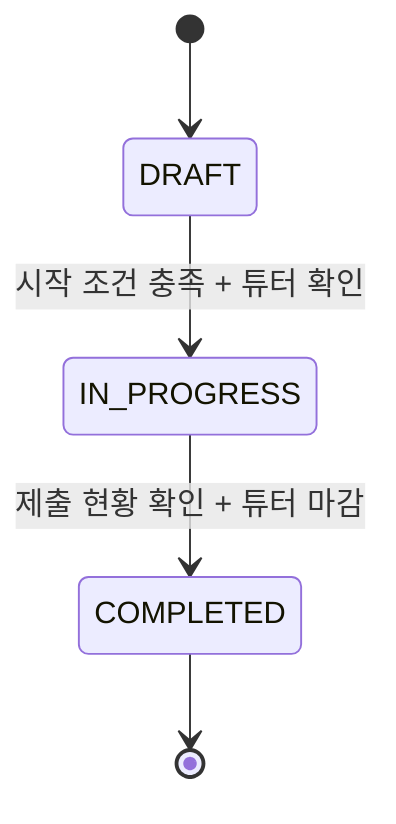

# AX 평가 시스템 정제 요구사항

| 항목 | 내용 |
|---|---|
| 문서 ID | AX-RR-001 |
| 버전 | 1.4 |
| 기준일 | 2026-08-15 |
| 상태 | 2단계 리뷰 및 MVP 범위 재검토 완료 기준선 |
| 선행 문서 | `REQUIREMENTS.md`, `FLOWS.md`, `TECHNICAL_DECISIONS.md` |
| 적용 범위 | MVP 설계·구현·인수 테스트 |

## 1. 문서 목적과 규범

이 문서는 기존 통합 요구사항을 소프트웨어 요구사항과 아키텍처 관점에서 검증하고, 구현자가
추가 해석 없이 모델·서비스·화면·테스트를 설계할 수 있도록 정제한 최종 기준선이다.

요구사항의 규범 용어는 다음과 같다.

- **필수(MUST)**: MVP 출시 조건이다.
- **권장(SHOULD)**: 특별한 제약이 없으면 구현한다. 제외 시 근거를 ADR 또는 PR에 남긴다.
- **제외(OUT)**: MVP에서 구현하지 않는다.

문서 간 충돌 시 우선순위는 다음과 같다.

```text
REFINED-REQUIREMENTS.md
> REQUIREMENTS.md
> TECHNICAL_DECISIONS.md
> FLOWS.md
```

## 2. 제품 목표와 MVP 경계

### 2.1 목표

시스템은 수강생 등록부터 다음 회차 팀 편성까지의 평가 주기를 데이터 무결성과 권한을
보장하면서 반복 운영해야 한다.

```text
수강생 준비
→ 회차·참가자·문항 확정
→ 팀 자동 배치·수동 조정·저장
→ 팀 평가·개인 평가
→ 제출 현황 확인·마감
→ 채점·검토·공개
→ 시드 산출
→ 다음 회차 편성
```

### 2.2 MVP 포함

- Django Auth 세션, 비밀번호 로그인, Google OIDC 로그인과 수강생·튜터/관리자 권한
- 회차별 참가자 스냅샷, 평가 기간, 재사용 가능한 팀·개인 평가 템플릿과 문항
- 시드 기반 자동 초기 배치와 동일 화면의 수동 팀 조정
- 다른 팀 평가와 팀 내 개인 평가
- 제출 현황, 강제 마감 경고, 부분 데이터 표시
- 팀 점수, 개인 점수, 최종점수, 경쟁 순위
- 항목별 결과 공개, 재채점 이력, 다음 회차 시드
- 관리자 중요 작업 감사 기록

### 2.3 MVP 제외

- Google 외 소셜 로그인, 공개 회원가입, 자동 계정 생성, 화이트리스트 승인, 강제 온보딩
- 공지, 이메일·푸시·실시간 알림
- 레이더 차트, 역량 분석, 통계 그래프, Excel 다운로드
- 학생 대상 자유 서술 피드백 공개와 튜터 피드백 작성
- 평가 임시저장, 제출 후 학생 수정, 전체 평가 일괄 최종 제출
- 발표 팀별 실시간 평가 개방, SPA·공개 REST API
- 과제 안내·자료 관리, 팀 결과물 파일·링크 업로드와 제출 버전 관리

## 3. 용어와 해석

| 용어 | 정제 정의 |
|---|---|
| 평가 회차 | 참가자·팀·문항·평가·결과가 귀속되는 불변의 업무 경계 |
| 현재 회차 | 유일하게 `IN_PROGRESS`인 회차. 없을 수 있지만 둘 이상일 수 없다. |
| 회차 참가자 | 회차 시작 전에 확정한 수강생 스냅샷. 전역 활성 상태와 구분한다. |
| 팀 평가 | 회차 참가자가 본인 팀을 제외한 다른 모든 팀을 평가하는 행위 |
| 개인 평가 | 회차 참가자가 같은 팀의 다른 구성원을 평가하는 행위. 자기 평가는 아니다. |
| 평가 템플릿 | 같은 평가 유형의 문항을 묶은 재사용 질문지. TEAM과 PEER로 구분한다. |
| 평가 문항 | 평가 템플릿에 속하며 순서·문구·응답 유형·필수 여부를 가진 질문 |
| 제출 점수 | 한 평가자가 한 대상에게 제출한 척도형 문항의 평균 |
| 팀 점수 | 한 팀이 받은 유효한 팀 평가 제출 점수의 평균 |
| 개인 점수 | 한 참가자가 받은 유효한 개인 평가 제출 점수의 평균 |
| 최종점수 | `팀 점수 × 40% + 개인 점수 × 60%` |
| 커버리지 | `유효 제출 수 / 기대 제출 수` |
| N/A | 유효 제출이 없어 점수를 계산할 수 없는 상태. 0점과 다르다. |
| 시드 | 다음 회차 자동편성에 사용하는 최근 유효 최종점수의 가중평균 |

## 4. 역할과 권한

| 역할 | 허용 범위 | 금지 범위 |
|---|---|---|
| 수강생 | 본인 현재 회차·팀 조회, 허용 대상 평가, 본인 작성 응답 조회, 공개 결과 조회 | 관리자 작업, 타인의 개인 결과·작성 응답, 평가 작성자 식별 |
| 튜터 | 참가자·회차·팀 운영, 등록된 TEAM·PEER 질문 템플릿 선택, 평가 현황·결과 운영, 자유 서술 응답 조회 | 회차 화면에서 개별 문항 생성·수정, 학생 대신 평가 제출, 감사 기록 없는 핵심 상태 변경 |
| Django staff 운영 관리자 | 계정·권한 운영, 재사용 질문 템플릿과 소속 문항 등록 | 시작된 회차가 참조한 템플릿·문항 변경, 평가·결과 직접 변조 |
| Django superuser | 장애 복구 | 일반 운영 흐름을 우회한 업무 데이터 변조 |

권한은 메뉴 노출과 별개로 모든 GET·POST·직접 URL에서 서버가 검사한다. 객체 단위 권한은
로그인 사용자, 회차 참가 여부, 역할, 평가 대상 자격을 함께 확인한다.

## 5. 상태 모델과 불변 조건

### 5.1 회차 상태



| 상태 | 허용 | 금지 |
|---|---|---|
| `DRAFT` | 참가자·기간·TEAM·PEER 질문 템플릿 연결·팀 편성 및 수정 | 회차별 문항 편집, 평가 제출, 채점, 결과 공개 |
| `IN_PROGRESS` | 평가 제출, 제출 현황 조회 | 참가자·팀·템플릿 연결·참조 문항 변경, 채점, 결과 공개 |
| `COMPLETED` | 채점·재채점·공개·결과·시드 조회 | 평가 제출, 참가자·팀·템플릿 연결·참조 문항 변경 |

상태는 역전하지 않는다. `end_at` 도달은 제출을 즉시 막지만 회차 상태를 자동으로
`COMPLETED`로 바꾸지 않는다. 튜터가 미제출 현황을 확인하고 명시적으로 마감한다.

### 5.2 평가 제출 가능 조건

다음 조건을 모두 만족할 때만 제출할 수 있다.

```text
authenticated
AND role == STUDENT
AND user is RoundParticipant
AND round.status == IN_PROGRESS
AND evaluation_start_at <= now < evaluation_end_at
AND target is eligible
AND no existing submission
```

시각은 DB에 UTC로 저장하고 UI에는 `Asia/Seoul`로 표시한다. `evaluation_end_at`과 정확히
같은 시각의 요청은 마감 후 요청이다.

### 5.3 결과 상태

| 상태 | 의미 | 학생 화면 |
|---|---|---|
| `NOT_CALCULATED` | 활성 채점 실행이 없음 | 집계 대기 |
| `CALCULATED` | 채점 완료, 모든 공개 플래그 꺼짐 | 비공개 안내 |
| `PUBLISHED` | 하나 이상의 공개 플래그 켜짐 | 허용 항목만 표시 |

재채점은 새 계산 버전을 만들고 공개 플래그를 모두 끈다. 이전 계산 버전은 관리자 감사 목적으로
보존하지만 학생 화면에는 항상 활성 버전 하나만 사용한다.

## 6. 기능 요구사항

### 6.1 시스템, 인증, 관리자 경계

| ID | 우선순위 | 요구사항 | 인수 기준 |
|---|---|---|---|
| SYS-001 | 필수 | Django 5.2, PostgreSQL, Django Template, Bootstrap 5.3을 사용한다. | 지원 버전으로 시스템 검사와 전체 테스트가 통과한다. |
| SYS-002 | 필수 | 로그인·로그아웃과 보호 URL을 Django Auth 세션으로 처리한다. | 비로그인 보호 요청은 로그인으로 이동하고 로그아웃 후 재접근이 차단된다. |
| SYS-003 | 필수 | 업무상 현재 회차는 최대 하나다. | 두 번째 `IN_PROGRESS` 전환을 DB 또는 트랜잭션 서비스가 거부한다. |
| SYS-004 | 필수 | Django Admin은 계정과 초안 회차 같은 기본 관리에 사용한다. | 핵심 업무 외 모델은 역할별 CRUD가 가능하다. |
| SYS-005 | 필수 | 제출 응답, 시작된 회차의 팀원 관계, 계산 결과, 공개 상태는 Admin에서 읽기 전용 또는 전용 서비스로만 변경한다. | Admin 직접 편집으로 핵심 제약을 우회할 수 없다. |
| AUTH-001 | 필수 | 수강생과 튜터/관리자 역할을 서버에서 구분한다. | 역할별 허용·거부 테스트가 존재한다. |
| AUTH-002 | 필수 | 수강생은 다른 학생의 개인 결과와 작성 응답에 접근할 수 없다. | ID를 바꾼 URL·POST가 403 또는 404이며 데이터가 노출되지 않는다. |
| AUTH-003 | 필수 | 자유 서술 입력을 안전하게 이스케이프해 렌더링한다. | 스크립트 문자열이 실행되지 않고 일반 텍스트로 표시된다. |
| AUTH-004 | 필수 | Google 로그인은 backend authorization code flow와 `openid email profile` 최소 scope를 사용한다. | 브라우저가 Google token을 저장하거나 업무 API에 직접 전달하지 않는다. |
| AUTH-005 | 필수 | Google 계정은 ID Token의 불변 `sub`로 식별한다. | User의 `google_sub`는 중복될 수 없고 email을 로그인 이후의 외부 식별자로 사용하지 않는다. |
| AUTH-006 | 필수 | 최초 연결은 `email_verified=true`인 email과 정확히 일치하는 사전 등록 active 계정에만 허용한다. | 미등록·비활성·기연결 충돌 계정은 자동 생성·재연결하지 않고 거부한다. |
| AUTH-007 | 필수 | callback은 5분 TTL의 일회성 `state`·`nonce`와 ID Token signature, `iss`, `aud`, `exp`를 검증한다. | 불일치·만료·재사용 요청은 Django 세션을 만들지 않는다. |
| AUTH-008 | 필수 | authorization code와 ID/access token은 callback 처리 메모리에서만 사용 후 폐기하고 refresh token은 요청·저장하지 않는다. | DB·세션·쿠키·브라우저 저장소·로그에 Google token 원문이 없다. |
| AUTH-009 | 필수 | 비밀번호 또는 Google 인증 성공 후 14일 persistent Django 세션을 생성한다. | 같은 브라우저를 닫았다 다시 열어도 만료 전 로그인이 유지되고, 명시적 로그아웃·만료 시 접근이 차단된다. |

### 6.2 수강생과 회차 참가자

| ID | 우선순위 | 요구사항 | 인수 기준 |
|---|---|---|---|
| ACC-001 | 필수 | 관리자는 수강생 계정, 이름, 식별번호, 활성 상태를 관리한다. | 식별번호는 중복되지 않고 `is_active=False` 계정의 로그인은 거부된다. |
| ACC-002 | 필수 | 새 회차는 활성 수강생 중 참가자를 명시적으로 선택한다. | 회차별 참가자 목록이 저장된다. |
| ACC-003 | 필수 | 회차 시작 시 참가자 목록을 동결한다. | 이후 전역 계정 정보·활성 상태 변경이 진행·완료 회차의 참가자·기대 제출 수를 바꾸지 않는다. |
| ACC-004 | 필수 | 참가자는 시작 전에 정확히 한 팀에 속해야 한다. | 미배정·중복 배정 참가자가 있으면 시작이 거부된다. |
| ACC-005 | 필수 | 학생 홈은 현재 회차, 팀, 팀·개인 평가 진행률, 마감 시각을 표시한다. | 현재 회차가 없으면 명시적 빈 상태를 표시한다. |
| ACC-006 | 권장 | 미완료 평가는 마감 임박순으로 표시한다. | 미완료·완료·마감 상태가 텍스트로 구분된다. |

### 6.3 회차, 기간, 평가 템플릿과 문항

| ID | 우선순위 | 요구사항 | 인수 기준 |
|---|---|---|---|
| RND-001 | 필수 | 회차는 제목·설명, 평가 시작·종료 시각, 목표 팀 수를 가진다. | `evaluation_start_at < evaluation_end_at`, `team_count >= 2`가 검증된다. |
| RND-002 | 필수 | 회차는 `DRAFT → IN_PROGRESS → COMPLETED`로만 전이한다. | 역방향·건너뛰기 전이가 거부된다. |
| RND-003 | 필수 | 시작 조건은 참가자 목록 확정, 전원 팀 배정, 2개 이상 비어 있지 않은 팀, TEAM·PEER 템플릿과 각 템플릿의 척도 문항, 유효 기간이다. | 하나라도 빠지면 시작되지 않고 원인을 표시한다. |
| RND-004 | 필수 | 튜터는 회차마다 TEAM 템플릿과 PEER 템플릿을 하나씩 지정한다. | 템플릿 category가 다른 연결과 유형별 누락을 거부한다. |
| RND-005 | 필수 | Django staff 운영 관리자는 재사용 질문 템플릿에 순서·문구·응답 유형·필수 여부를 가진 문항을 등록한다. 튜터는 회차 화면에서 등록된 템플릿만 선택하며 개별 문항을 변경하지 않는다. | 템플릿 문항이 순서대로 동적 폼에 반영되고 회차 편집 요청에는 문항 CUD 필드·API가 없다. |
| RND-006 | 필수 | MVP 척도형 문항은 정수 1~5만 허용한다. | 누락·0·6·소수·문자 입력이 거부된다. |
| RND-007 | 필수 | 자유 서술형 답변은 문항별 최대 2,000자다. | 초과 입력은 저장되지 않고 필드 오류를 표시한다. |
| RND-008 | 필수 | 시작된 회차의 참가자·팀·템플릿 연결과 참조 템플릿·문항은 변경할 수 없다. | 사용된 템플릿 변경은 복제본을 만들어 DRAFT 회차에 연결할 때만 가능하다. |
| RND-009 | 필수 | 미제출이 있어도 튜터는 목록 확인과 재확인 후 회차를 마감할 수 있다. | 경고 없이 강제 마감할 수 없다. |

### 6.4 팀 편성

| ID | 우선순위 | 요구사항 | 인수 기준 |
|---|---|---|---|
| TEAM-001 | 필수 | 팀 편성은 하나의 편집 화면에서 자동 초기 배치와 학생 이동·교환을 함께 제공한다. | 자동 배치 직후 화면 전환 없이 수동으로 조정할 수 있다. |
| TEAM-002 | 필수 | 튜터는 `2 <= 팀 수 <= 참가자 수` 범위에서 자동 초기 배치를 생성한다. | 잘못된 팀 수는 화면 구성과 DB 변경 없이 거부된다. |
| TEAM-003 | 필수 | 자동편성의 팀별 인원 차이는 최대 1명이다. | 모든 참가자가 정확히 한 번 배정된다. |
| TEAM-004 | 필수 | 유효 시드 보유자의 팀 평균 모집단 표준편차를 초기 후보보다 악화시키지 않는다. | 실행 전후 목적 함수와 유효 시드 인원을 표시한다. |
| TEAM-005 | 필수 | 무시드 참가자는 0점으로 대체하지 않고 남은 정원에 무작위 균등 배치한다. | 전원 무시드여도 인원 균형 후보가 생성된다. |
| TEAM-006 | 권장 | 성적 균형을 악화시키지 않는 범위에서 직전 회차 동일 팀 쌍을 줄인다. | 남은 반복 쌍은 실패가 아니라 검토 정보다. |
| TEAM-007 | 필수 | 자동 초기 배치와 화면상 수동 조정은 저장 전 학생에게 공개하거나 권위 데이터로 사용하지 않는다. | 저장 전 조작만으로 학생의 팀 조회 결과가 변하지 않는다. |
| TEAM-008 | 필수 | 저장 시 서버가 참가자 집합, 중복, 누락, 빈 팀, 회차 상태를 다시 검증한다. | 변조된 클라이언트 배열이 저장되지 않는다. |
| TEAM-009 | 필수 | 현재 화면의 팀과 팀원 관계를 하나의 트랜잭션으로 저장한다. | 부분 저장이 없고 실패 시 기존 구성이 유지된다. |
| TEAM-010 | 필수 | 수동 조정 결과의 인원 차이가 1명을 넘으면 경고와 재확인을 요구하되 저장은 허용한다. | 경고 없이 불균형 구성을 저장할 수 없다. |
| TEAM-011 | 필수 | 같은 DRAFT 구성을 동시에 수정할 때 먼저 성공한 변경만 반영한다. | 뒤 요청은 버전 충돌로 거부되고 최신 구성 재조회를 요구한다. |
| TEAM-012 | 필수 | `IN_PROGRESS`와 `COMPLETED` 회차의 팀은 읽기 전용이다. | 평가 제출 유무와 관계없이 시작 후 팀 변경이 차단된다. |
| TEAM-013 | 필수 | 저장 결과에는 자동·수동 구분, 후보 상태, 편성 실행 이력을 기록하지 않는다. | 저장된 팀 구성은 생성 경로와 무관하게 동일한 구조다. |
| TEAM-014 | 필수 | 자동편성 최적화는 개선 교환이 없거나 최대 100회에 도달하면 종료한다. | 모든 유효 입력에서 유한 시간 안에 현재 최선 후보를 반환한다. |

자동편성에서 유효 시드가 있는 팀 평균이 둘 미만이면 표준편차를 계산하지 않고 성적 최적화를
건너뛴다. 이 경우 품질 지표는 `N/A`로 표시하되 인원 균형과 무시드 배치는 정상 수행한다.
시드 보유자를 목표 인원에 맞춰 무작위 초기 배치한 뒤 표준편차를 감소시키는 교환만 채택한다.
목적 함수 비교는 화면 반올림 전 Decimal 정밀도를 사용한다.

### 6.5 팀 평가

| ID | 우선순위 | 요구사항 | 인수 기준 |
|---|---|---|---|
| TR-001 | 필수 | 참가자는 본인 팀을 제외한 시작된 회차의 모든 팀을 평가한다. | 본인 팀은 목록·기대 건수·POST 대상에서 제외된다. |
| TR-002 | 필수 | 대상 팀마다 현재 회차의 팀 평가 문항에 응답한다. | 필수 답변이 모두 있어야 한 건으로 저장된다. |
| TR-003 | 필수 | 제출은 대상별로 한 번만 가능하고 저장 후 학생이 수정·삭제할 수 없다. | `(round, evaluator, target_team)`이 유일하며 재POST가 기존 값을 바꾸지 않는다. |
| TR-004 | 필수 | 제출은 모든 답변과 제출 메타데이터를 한 트랜잭션으로 저장한다. | 일부 답변만 저장되는 상태가 없다. |
| TR-005 | 필수 | 제출 전 대상 자격, 상태, 기간, 회차 문항, 점수 범위를 서버가 재검증한다. | 조작된 ID·문항·값이 저장되지 않는다. |
| TR-006 | 필수 | 대상별 완료 상태와 `완료 수 / 기대 수` 진행률을 표시한다. | DB의 유효 제출을 기준으로 계산한다. |
| TR-007 | 필수 | 중복 브라우저 요청은 성공처럼 덮어쓰지 않고 기존 제출 완료를 안내한다. | 동일 요청 동시 처리에도 한 건만 남는다. |

### 6.6 개인 평가

| ID | 우선순위 | 요구사항 | 인수 기준 |
|---|---|---|---|
| PR-001 | 필수 | 개인 평가 대상은 같은 회차·같은 팀의 다른 참가자다. | 자기 자신과 다른 팀 참가자는 목록·기대 건수·POST 대상에서 제외된다. |
| PR-002 | 필수 | 대상자마다 현재 회차의 개인 평가 문항에 응답한다. | 필수 답변이 모두 있어야 한 건으로 저장된다. |
| PR-003 | 필수 | 제출은 대상별로 한 번만 가능하고 저장 후 학생이 수정·삭제할 수 없다. | `(round, evaluator, target_participant)`가 유일하며 재POST가 기존 값을 바꾸지 않는다. |
| PR-004 | 필수 | 제출은 모든 답변과 제출 메타데이터를 한 트랜잭션으로 저장한다. | 일부 답변만 저장되는 상태가 없다. |
| PR-005 | 필수 | 제출 전 같은 팀, 자기 평가, 상태, 기간, 문항, 점수 범위를 서버가 재검증한다. | URL·POST 변조가 저장되지 않는다. |
| PR-006 | 필수 | 대상별 완료 상태와 `완료 수 / 기대 수` 진행률을 표시한다. | 본인을 제외한 동결 팀원 수를 분모로 사용한다. |
| PR-007 | 필수 | 1인 팀은 `평가 대상 없음`의 정상 완료 상태다. | 기대 수 0을 미제출이나 오류로 표시하지 않는다. |
| PR-008 | 필수 | 학생은 본인이 작성한 제출만 읽기 전용으로 조회한다. | 다른 평가자의 응답과 작성자별 결과는 노출되지 않는다. |
| PR-009 | 필수 | 동일 대상 동시 제출에도 한 건만 저장한다. | 유니크 제약 충돌이 사용자 오류 화면으로 안전하게 처리된다. |

### 6.7 제출 현황과 데이터 완결성

| ID | 우선순위 | 요구사항 | 인수 기준 |
|---|---|---|---|
| SUB-001 | 필수 | 학생은 팀·개인 평가의 대상별 완료 상태를 통합 조회한다. | 미완료 대상에서 해당 폼으로 이동할 수 있다. |
| SUB-002 | 필수 | 튜터는 평가 유형·학생·대상별 기대·완료·미완료 건수를 조회한다. | 자기 팀·본인·대상 없음이 분모에서 정확히 제외된다. |
| SUB-003 | 필수 | 기대 제출 집합은 회차 시작 시 동결된 참가자·팀으로 결정한다. | 전역 프로필 변경이 과거·진행 회차 분모를 바꾸지 않는다. |
| SUB-004 | 필수 | 대상 데이터 상태는 `NOT_APPLICABLE`, `COMPLETE`, `PARTIAL`, `NO_DATA` 중 하나다. | 기대 수와 유효 수로 상태가 결정된다. |
| SUB-005 | 필수 | `PARTIAL`은 받은 유효 제출만 평균하고 누락분을 0점으로 대체하지 않는다. | 점수와 함께 커버리지와 경고가 저장·표시된다. |
| SUB-006 | 필수 | `NO_DATA`와 `NOT_APPLICABLE`의 점수는 N/A이며 순위·시드에서 제외한다. | 0.00으로 저장·표시되지 않는다. |
| SUB-007 | 필수 | 미제출이 있는 강제 마감은 튜터, 시각, 미제출 건수와 확인 사실을 감사 기록에 남긴다. | 마감 감사 이벤트를 조회할 수 있다. |

참가자 수를 `P`, 팀 수를 `K`, 특정 팀 인원을 `n(t)`라 할 때 기대 제출 수는 다음과 같다.

```text
특정 팀이 받아야 할 팀 평가 수 = P - n(t)
전체 팀 평가 기대 수 = Σ(P - n(t)) = P × (K - 1)

특정 참가자가 받아야 할 개인 평가 수 = n(t) - 1
전체 개인 평가 기대 수 = Σ(n(t) × (n(t) - 1))
```

데이터 상태 판정은 다음과 같다.

```text
expected == 0                    → NOT_APPLICABLE, 진행 상태는 정상 완료
expected > 0 AND valid == 0      → NO_DATA
0 < valid < expected             → PARTIAL
expected > 0 AND valid == expected → COMPLETE
```

### 6.8 채점, 순위, 공개, 시드

| ID | 우선순위 | 요구사항 | 인수 기준 |
|---|---|---|---|
| RES-001 | 필수 | 한 제출의 척도형 문항은 동일 가중 평균해 1~5점 제출 점수를 만든다. | 자유 서술형은 계산에서 제외되며 100점 환산값을 저장하지 않는다. |
| RES-002 | 필수 | 팀 점수는 팀이 받은 유효 팀 평가 제출 점수의 동일 가중 평균이다. | 자기 팀·중복·무효 제출은 포함되지 않는다. |
| RES-003 | 필수 | 개인 점수는 참가자가 받은 유효 개인 평가 제출 점수의 동일 가중 평균이다. | 자기·다른 팀·중복·무효 제출은 포함되지 않는다. |
| RES-004 | 필수 | 최종점수는 팀 점수 40%와 개인 점수 60%의 합이다. | 두 구성 점수 중 하나가 N/A면 최종점수도 N/A다. |
| RES-005 | 필수 | 중간 계산은 Decimal로 수행하고 공개 점수는 `ROUND_HALF_UP`으로 소수 둘째 자리까지 반올림한다. | 부동소수점 오차 없이 고정 예제와 일치한다. |
| RES-006 | 필수 | 순위는 공개 점수 기준 경쟁 순위 `1,2,2,4`를 사용한다. | N/A는 순위에서 제외되고 동점 다음 순위가 건너뛴다. |
| RES-007 | 필수 | 채점은 `COMPLETED` 회차에서 튜터가 수동 실행한다. | 진행 회차 채점 요청이 거부된다. |
| RES-008 | 필수 | 채점 실행은 입력 제출 수·커버리지·공식 버전·실행자·시각을 포함한 불변 계산 버전을 만든다. | 같은 버전의 결과 근거를 관리자 화면에서 확인할 수 있다. |
| RES-009 | 필수 | 재채점은 새 버전을 원자적으로 생성하고 모든 공개 플래그를 끈다. | 실패 시 기존 활성 버전과 공개 상태가 유지된다. |
| RES-010 | 필수 | 팀 1위, 전체 팀 순위, 본인 최종점수, 본인 개인 순위를 독립 공개한다. | 비공개 항목은 학생 응답과 HTML에 값이 포함되지 않는다. |
| RES-011 | 필수 | `PARTIAL` 결과를 공개하려면 커버리지 경고 후 튜터가 추가 확인한다. | 추가 확인 없이 공개 플래그를 켤 수 없다. |
| RES-012 | 필수 | 학생은 본인 개인 결과와 공개된 팀 단위 결과만 조회한다. | 다른 학생 개인 결과 접근이 차단된다. |
| RES-013 | 필수 | 자유 서술형 응답은 MVP에서 튜터/관리자만 조회한다. | 학생 화면과 학생용 응답에 원문·작성자가 없다. |
| RES-014 | 필수 | 팀 점수는 회차 시작 시 팀 구성원 모두에게 같은 구성 점수로 적용한다. | 이후 전역 계정 상태와 무관하게 동결 멤버십을 사용한다. |
| RES-015 | 필수 | 시드는 최근 최대 3개의 유효 최종점수에 오래된 순 20%·30%·50%를 적용한다. | 2개면 30:50을, 1개면 50을 100%로 재정규화한다. |
| RES-016 | 필수 | N/A 회차는 시드 이력에서 제외하고 유효 이력이 없으면 무시드로 처리한다. | 0점으로 대체하지 않는다. |
| RES-017 | 필수 | 시드는 별도 테이블에 저장하지 않고 활성 계산 결과에서 조회 시 계산한다. | 결과 공개 여부와 무관하게 같은 활성 결과로 같은 시드를 계산한다. |

### 6.9 감사, 삭제, 보존

| ID | 우선순위 | 요구사항 | 인수 기준 |
|---|---|---|---|
| AUD-001 | 필수 | Google 계정 최초 연결, 회차 시작·강제 마감, 팀 구성 저장, 채점·재채점, 공개 변경을 감사 기록한다. | actor, action, target, timestamp, 결과와 변경 요약이 남는다. |
| AUD-002 | 필수 | 감사 로그에는 비밀번호, session ID, OAuth code·token·state·nonce, 평가 자유 서술 원문을 기록하지 않는다. | 민감 필드가 로그에 없는지 테스트·검토한다. |
| AUD-003 | 필수 | 시작된 회차가 참조하는 참가자·팀·문항·제출·결과는 하드 삭제하지 않는다. | 참조 객체 삭제가 보호되거나 비활성화로 전환된다. |
| AUD-004 | 필수 | 팀 구성 감사에는 자동·수동 방식이나 후보 상태를 기록하지 않는다. | 최종 팀 구성 저장 사실만 감사 대상이다. |
| AUD-005 | 필수 | 운영 로그와 감사 로그의 접근은 튜터/관리자 중 허가된 사용자로 제한한다. | 수강생 접근이 차단된다. |

## 7. 아키텍처 경계와 데이터 소유권

| 앱 | 소유 데이터 | 외부 제공 책임 | 소유하지 않는 것 |
|---|---|---|---|
| `accounts` | 사용자, 학생 식별 정보, 역할·활성 상태 | 로그인 사용자와 역할 | 회차 참가·팀·점수 |
| `rounds` | 회차, 회차 참가자, 질문 템플릿 마스터·소속 문항 | 상태, 기간, 동결 참가자·질문지 | 회차별 직접 문항, 팀 구성, 평가 제출, 결과 |
| `teams` | 회차별 팀, 팀원 관계 | 동결 팀과 평가 대상 관계 | 편성 방식·후보 상태, 원점수, 결과 계산 |
| `reviews` | TEAM·PEER 공통 제출과 문항 응답 | 유형별 대상 검증·유효 제출 입력 | 회차 상태, 팀, 최종 결과 |
| `results` | 계산 실행, TEAM·INDIVIDUAL 공통 결과, 순위, 공개 시각 | 활성 결과와 조회 시 계산 시드 | 팀 편성 저장 |
| `audit` | 중요 도메인 작업의 추가 전용 감사 이벤트 | 운영 감사 조회 | 평가 원문, 편성 방식, 비밀번호 |

의존 방향은 다음을 원칙으로 한다.

```text
accounts ← rounds ← teams
rounds + teams ← reviews
rounds + teams + reviews ← results
```

`results`는 팀을 직접 편성하지 않는다. 다음 회차 팀 편집 화면이 `results`에서 계산한 시드를
읽어 자동 초기 배치 함수를 호출하고, 최종 배열만 `teams` 저장 서비스에 전달한다.

### 7.1 핵심 개념 데이터

```text
EvaluationRound
├─ RoundParticipant[]
├─ Team[] ─ TeamMembership[]
├─ QuestionTemplate(category=TEAM) ─ TemplateQuestion[]
├─ QuestionTemplate(category=PEER) ─ TemplateQuestion[]
├─ ReviewSubmission[] (TEAM | PEER) ─ ReviewAnswer[]
└─ CalculationRun[]
   └─ EvaluationResult[] (TEAM | INDIVIDUAL)
```

외래키와 삭제 정책은 역사적 의미가 보존되도록 `PROTECT` 또는 동등한 보호를 기본으로 한다.
사용자 탈퇴·수강 종료는 과거 기록 삭제가 아니라 계정 비활성화로 처리한다.

### 7.2 필수 DB 제약과 서비스 불변 조건

| 대상 | 제약 또는 불변 조건 | 보호 목적 |
|---|---|---|
| 현재 회차 | `status=IN_PROGRESS` 행은 전체 시스템에서 최대 1개 | 현재 회차 모호성 방지 |
| 회차 참가자 | `UNIQUE(round_id, student_id)` | 같은 학생의 회차 중복 참가 방지 |
| 팀 | `UNIQUE(round_id, team_number)` | 회차 내 팀 번호 중복 방지 |
| 팀원 관계 | `UNIQUE(participant_id)` | 한 참가자의 회차 내 중복 팀 배정 방지 |
| 팀원 관계 | participant, team, membership의 round가 같음 | 다른 회차 데이터 혼합 방지 |
| 문항 | `UNIQUE(template_id, display_order)` | 템플릿 내 순서 중복 방지 |
| 템플릿 연결 | 회차의 team/peer FK와 template category 일치 | 잘못된 유형 질문지 사용 방지 |
| 평가 제출 대상 | review_type에 맞는 target FK 정확히 하나만 존재 | TEAM·PEER 대상 혼합 방지 |
| 팀 평가 제출 | TEAM partial `UNIQUE(round_id, evaluator_id, target_team_id)` | 중복 팀 평가 방지 |
| 개인 평가 제출 | PEER partial `UNIQUE(round_id, evaluator_id, target_participant_id)` | 중복 개인 평가 방지 |
| 평가 답변 | `UNIQUE(submission_id, question_id)` | 같은 문항 중복 응답 방지 |
| 척도 답변 | 정수 `1 <= value <= 5` | 범위 밖 점수 방지 |
| 평가 답변 | question이 제출 회차와 평가 범위에 속함 | 문항 변조·다른 폼 응답 방지 |
| 계산 실행 | 회차별 활성 계산 버전 최대 1개 | 학생 결과 기준의 단일성 보장 |
| 평가 결과 대상 | result_type에 맞는 target FK 정확히 하나와 유형별 partial UNIQUE | 팀·개인 결과 혼합·중복 방지 |

같은 회차 여부처럼 여러 테이블을 함께 봐야 하는 조건은 저장 서비스가 트랜잭션 안에서
검증한다. PostgreSQL 제약이나 트리거로 안전하게 보강할 수 있으면 함께 적용하되, 모든 쓰기
경로가 같은 도메인 서비스를 사용해야 한다.

## 8. 비기능 요구사항

| ID | 구분 | 우선순위 | 요구사항·인수 기준 |
|---|---|---|---|
| NFR-001 | 보안 | 필수 | CSRF, Django 비밀번호 해시, 운영 `Secure`·`HttpOnly`·`SameSite=Lax` 세션 쿠키, 로그인 시 session key rotation, 환경변수 비밀정보, 서버 객체 권한을 적용한다. |
| NFR-002 | 로그인 보호 | 필수 | 동일 계정 또는 IP에서 15분 내 5회 연속 실패하면 최소 15분간 추가 시도를 제한하고 로그에 비밀번호를 남기지 않는다. |
| NFR-003 | 접근성 | 필수 | WCAG 2.1 AA를 목표로 레이블, 키보드 접근, 포커스, 대비, 텍스트 상태를 제공한다. |
| NFR-004 | 반응형 | 필수 | 360px 너비에서 핵심 제출 흐름이 가능하고 넓은 표는 가로 스크롤된다. |
| NFR-005 | 성능 | 필수 | 참가자 200명, 팀 40개, 유형별 문항 20개, 동시 사용자 50명에서 일반 조회 p95 2초, 제출 p95 3초 이내다. |
| NFR-006 | 동시성 | 필수 | 중복 제출·팀 구성 저장·채점 동시 요청에도 유니크 제약과 트랜잭션으로 단일 결과를 보장한다. |
| NFR-007 | 운영성 | 필수 | 5xx, 채점 실패, 트랜잭션 충돌을 구조화 로그로 남기되 평가 원문과 비밀정보는 제외한다. |
| NFR-008 | 복구 | 필수 | 운영 DB는 일 단위 백업 정책을 가지며 복구 절차를 배포 전에 한 번 이상 검증한다. |
| NFR-009 | 정적 자산 | 권장 | 운영 핵심 화면이 공용 CDN 장애만으로 사용할 수 없게 되지 않도록 정적 자산을 자체 제공한다. |
| NFR-010 | 품질 | 필수 | Ruff, formatter, djLint, Django check, migration check, 전체 테스트가 CI에서 통과해야 한다. |
| NFR-011 | Google 인증 | 필수 | OAuth client secret은 환경변수/secret manager에서 관리하고 callback URL은 등록된 HTTPS URI만 사용하며 code·token·state·nonce 원문을 로그에서 제외한다. |

성능 수치는 실제 교육 규모가 제공되지 않아 MVP 설계 기준으로 채택한 값이다. 규모가 이를
초과하면 출시 전에 부하 기준을 다시 승인한다.

## 9. 핵심 인수 시나리오

### AC-01 회차 시작 보호

```gherkin
Given 회차 참가자 중 한 명이 팀에 배정되지 않았을 때
When 튜터가 회차 시작을 요청하면
Then 상태는 DRAFT로 유지되고 미배정 참가자를 안내한다
```

### AC-02 마감 경계

```gherkin
Given 회차가 IN_PROGRESS이고 종료 시각이 18:00:00일 때
When 수강생의 제출 요청이 정확히 18:00:00에 도착하면
Then 제출은 저장되지 않고 마감 안내를 반환한다
```

### AC-03 자기·타 팀 개인 평가 차단

```gherkin
Given A가 1팀 참가자일 때
When A가 자신 또는 2팀 참가자에 대한 개인 평가 POST를 보내면
Then 어떤 제출과 답변도 저장되지 않는다
```

### AC-04 중복 제출

```gherkin
Given A가 2팀 평가를 이미 제출했을 때
When 같은 요청을 다시 보내면
Then 기존 제출은 바뀌지 않고 제출 완료 안내를 반환한다
```

### AC-05 시작 후 불변성

```gherkin
Given 회차가 IN_PROGRESS일 때
When 관리자가 참가자, 팀원 또는 문항 변경을 요청하면
Then 요청은 거부되고 평가 대상과 기대 건수는 유지된다
```

### AC-06 부분 데이터

```gherkin
Given 어떤 대상의 기대 제출이 10건이고 유효 제출이 7건일 때
When 채점을 실행하면
Then 상태는 PARTIAL, 커버리지는 70%, 점수는 7건의 평균으로 저장된다
And 공개에는 추가 확인이 필요하다
```

### AC-07 무응답

```gherkin
Given 어떤 참가자가 유효한 개인 평가를 한 건도 받지 못했을 때
When 채점을 실행하면
Then 개인 점수와 최종점수는 N/A이고 개인 순위와 시드에서 제외된다
```

### AC-08 재채점 원자성

```gherkin
Given 공개 중인 계산 버전이 있을 때
When 재채점이 성공하면
Then 새 버전이 활성화되고 모든 공개 플래그가 꺼진다
But 재채점이 실패하면 기존 버전과 공개 상태가 유지된다
```

### AC-09 팀 구성 저장 동시성

```gherkin
Given 두 튜터가 같은 DRAFT 팀 구성 버전을 열었을 때
When 첫 튜터의 변경이 먼저 저장되고 두 번째 튜터가 저장하면
Then 두 번째 요청은 충돌로 거부되고 첫 번째 구성은 유지된다
```

### AC-10 시드 재정규화

```gherkin
Given 한 참가자의 유효 최종점수가 과거 4.0, 최신 5.0 두 개일 때
When 시드를 계산하면
Then 시드는 (4.0×30 + 5.0×50) / 80 = 4.625다
```

### AC-11 개인 평가 대상 없음

```gherkin
Given 한 팀에 참가자가 한 명뿐일 때
When 개인 평가 목록과 제출 현황을 조회하면
Then 개인 평가 상태는 NOT_APPLICABLE이며 미제출 건수는 0이다
And 개인 점수와 최종점수는 N/A다
```

### AC-12 자동 배치 후 수동 조정

```gherkin
Given 튜터가 자동 초기 배치를 생성했을 때
When 같은 화면에서 학생을 다른 팀으로 이동하고 저장하면
Then 조정된 최종 팀과 팀원 관계만 저장된다
And 자동·수동 구분이나 후보 상태는 저장되지 않는다
```

### AC-13 템플릿 지정과 불변성

```gherkin
Given 운영 관리자가 TEAM·PEER 질문 템플릿과 소속 문항을 사전 등록하고
And 튜터가 DRAFT 회차에 두 템플릿을 지정했을 때
When 튜터가 회차를 시작하면
Then 각 템플릿의 문항이 해당 평가 폼에 사용된다
And 회차 화면에서는 개별 문항을 추가·수정·삭제할 수 없다
And 시작 후 템플릿 연결과 해당 템플릿·문항 변경은 거부된다
But 운영 관리자는 템플릿 복제본을 등록하고 튜터는 이를 다른 DRAFT 회차에 연결할 수 있다
```

### AC-14 Google 로그인 후 브라우저 재시작

```gherkin
Given 사전 등록된 active 사용자가 유효한 Google callback으로 로그인했을 때
When 브라우저를 닫았다가 14일 안에 같은 브라우저로 다시 접속하면
Then Google token 재사용 없이 django_session과 sessionid로 로그인 상태가 유지된다
And 업무 DB·브라우저 저장소·로그에는 Google token 원문이 없다
```

### AC-15 Google callback 재사용 차단

```gherkin
Given Google 로그인에 사용한 state와 nonce가 이미 소비되었을 때
When 같은 callback을 다시 요청하면
Then 요청은 거부되고 새 Django 로그인 세션이 생성되지 않는다
```

## 10. 기존 요구사항 추적성

| 기존 요구사항 | 정제 요구사항 |
|---|---|
| 시스템·Admin | SYS-001~SYS-005 |
| 인증·권한 | AUTH-001~AUTH-009, NFR-001~NFR-002, NFR-011 |
| 수강생 관리·홈 | ACC-001~ACC-006 |
| 회차·템플릿·문항 | RND-001~RND-009 |
| 팀 편성·조회 | TEAM-001~TEAM-014 |
| 팀 평가 | TR-001~TR-007 |
| 개인 평가 | PR-001~PR-009 |
| 제출 현황 | SUB-001~SUB-007 |
| 점수·순위·공개·시드 | RES-001~RES-017 |
| 무결성·운영 | AUD-001~AUD-005, NFR-001~NFR-011 |

페이지 전이는 `FLOWS.md`의 PG-01~03, PG-10~16, PG-20~25와 연결한다. 구현 PR은 관련 요구사항 ID와 인수
시나리오 ID를 설명에 포함해야 한다.

## 11. 출시 전 승인 항목

다음은 문서에서 구현 가능한 기본값을 채택했지만 제품 책임자의 명시적 승인을 받아야 한다.

| ID | 채택한 기본값 | 미승인 시 영향 |
|---|---|---|
| DEC-001 | 제출 후 학생 수정 불가, 서버 임시저장 없음 | 제출 모델과 UI 상태가 달라짐 |
| DEC-002 | 튜터는 등록된 질문 템플릿만 선택하고, 시작 후 참가자·팀·템플릿 연결·참조 문항을 완전 동결 | 템플릿 저작 권한이나 운영 중 정정 절차가 달라지면 권한·UI를 재설계해야 함 |
| DEC-003 | PARTIAL은 유효분 평균, 추가 확인 후 공개 가능 | 채점·공개 정책이 달라짐 |
| DEC-004 | 최근 3회 20%·30%·50% 시드 | 다음 팀 편성 결과가 달라짐 |
| DEC-005 | 학생에게 자유 서술 원문을 공개하지 않음 | 익명성·피드백 화면이 추가됨 |
| DEC-006 | 참가자 200명·동시 사용자 50명 성능 기준 | 인프라와 부하 테스트 범위가 달라짐 |
| DEC-007 | 과거 평가·결과는 하드 삭제하지 않고 계정만 비활성화 | 법적 보존·삭제 정책 확정 필요 |
| DEC-008 | MVP 업무 테이블 12개, 과제 업로드·편성 이력·유형별 중복 테이블 제외 | 후속 범위 추가 시 별도 스키마 확장이 필요함 |
| DEC-009 | Google 로그인은 사전 등록 계정 연결, token 비영속, Django 세션 14일 유지 | 공개 가입이나 Google API 접근이 필요하면 인증·credential 설계가 달라짐 |

개인정보 보존 기간은 교육 운영·법적 정책 자료가 없어 숫자로 확정하지 않았다. 운영 배포 전
보존 기간, 파기 주체, 익명화 방식은 별도 정책으로 반드시 승인한다.

## 12. 2단계 리뷰 기록

### 12.1 1차 리뷰 — 요구사항 품질

검토 기준: 완전성, 명확성, 일관성, 추적성, 테스트 가능성.

| 발견 ID | 발견 사항 | 조치 | 상태 |
|---|---|---|---|
| R1-01 | `현재 회차`가 여러 개일 수 있는지 불명확 | `IN_PROGRESS` 최대 1개로 정의 | 해결 |
| R1-02 | 전역 활성 학생과 회차 참가자가 혼재 | `RoundParticipant` 동결 개념 추가 | 해결 |
| R1-03 | 템플릿 요구를 회차별 직접 문항 또는 튜터의 문항별 편집으로 해석해 원 요구사항과 불일치 | 재사용 TEAM·PEER 질문 템플릿 마스터를 복원하고 튜터는 회차에서 선택만 수행 | 해결 |
| R1-04 | 상태와 시간 경계의 우선순위가 불명확 | 제출 조건식과 종료 시각 배타 경계 정의 | 해결 |
| R1-05 | 일부만 제출된 대상의 점수·공개 정책 없음 | COMPLETE/PARTIAL/NO_DATA와 공개 확인 추가 | 해결 |
| R1-06 | Admin CRUD가 핵심 무결성을 우회할 수 있음 | 핵심 모델 읽기 전용·서비스 경유로 제한 | 해결 |
| R1-07 | 개인 평가가 용어상 독립 기능으로 약하게 보임 | 별도 PR 요구사항과 인수 기준 유지 | 해결 |
| R1-08 | 권장 표현이 측정 불가능한 항목 존재 | 수치·상태·Given/When/Then 기준 추가 | 해결 |
| R1-09 | 과제 자료·팀 결과물 제출을 MVP로 오인해 범위가 확대됨 | 과제·업로드 전체를 MVP 제외로 명시 | 해결 |
| R1-10 | Google 로그인 token과 지속 세션의 수명주기가 정의되지 않음 | 5분 OAuth 임시 상태, token 폐기, 14일 Django 세션 정의 | 해결 |

1차 결론: **조건부 통과**. 데이터 스냅샷과 앱 간 의존성을 2차 아키텍처 리뷰에서 확인한다.

### 12.2 2차 리뷰 — 아키텍처와 무결성

검토 기준: 도메인 소유권, 불변 데이터, 트랜잭션, 동시성, 재현성, 보안, 운영 복구.

| 발견 ID | 발견 사항 | 조치 | 상태 |
|---|---|---|---|
| R2-01 | 팀·참가자·문항 변경이 평가 의미를 바꿀 수 있음 | 시작 시 완전 동결, 외래키 보호 | 해결 |
| R2-02 | `teams`가 `results` 시드를 읽고 `results`가 다음 편성을 호출하면 순환 가능 | 오케스트레이션 계층에서 단방향 서비스 호출 | 해결 |
| R2-03 | 브라우저 배열을 신뢰하면 중복·누락·변조 가능 | 저장 시 서버 전체 재검증·트랜잭션 | 해결 |
| R2-04 | 편성 후보·방식·시드 실행 이력 저장은 현재 팀 구성에 불필요함 | 자동 배치는 비영속 계산, 결과는 Team·Membership만 저장 | 해결 |
| R2-05 | 동시 팀 수정·제출·채점 충돌 정책 부족 | 낙관적 버전, DB 유니크 제약, 원자적 실행 | 해결 |
| R2-06 | 삭제와 Admin 수정으로 역사적 평가가 훼손될 수 있음 | 보호 삭제, 비활성화, 핵심 Admin 읽기 전용 | 해결 |
| R2-07 | 중요 운영 작업의 책임 추적이 없음 | 최소 감사 이벤트 요구사항 추가 | 해결 |
| R2-08 | 용량·복구·로그 기준이 없음 | MVP 성능 기준, 백업·구조화 로그 추가 | 해결 |
| R2-09 | 개인정보 보존 기간의 근거 자료가 없음 | 출시 전 승인 항목 DEC-007로 격리 | 미해결(외부 정책 필요) |
| R2-10 | 회차가 다른 참가자·팀·문항을 연결할 위험 | 필수 DB 제약과 교차 테이블 서비스 불변 조건 추가 | 해결 |
| R2-11 | 기대 제출 수와 대상 없음 상태가 수학적으로 불명확 | 유형별 기대 수 공식과 NOT_APPLICABLE 상태 추가 | 해결 |
| R2-12 | 로그인 반복 실패 제한이 측정 불가능 | 15분·5회·15분 제한 기준으로 수치화 | 해결 |
| R2-13 | 자동편성 최적화의 종료 조건이 정제본에서 누락 | 개선 없음 또는 최대 100회 종료 조건 추가 | 해결 |
| R2-14 | 28개 이상의 업무 테이블은 MVP 구현·운영 비용이 과도함 | 중복 구조는 제거하되 필수 템플릿을 복원해 12개로 확정 | 해결 |
| R2-15 | 자동·수동 편성을 별도 상태로 모델링하면 한 편집 흐름과 충돌함 | 자동 초기 배치 후 수동 조정, 저장 방식 단일화 | 해결 |
| R2-16 | 팀·개인 평가와 팀·개인 결과의 유형별 테이블이 같은 구조를 중복함 | ReviewSubmission/Answer와 EvaluationResult로 각각 통합 | 해결 |
| R2-17 | Google email을 외부 계정 키로 쓰면 주소 변경·충돌에 취약 | 불변 sub unique 연결과 verified email 최초 연결만 허용 | 해결 |
| R2-18 | Google token을 장기 로그인 수단으로 저장할 위험 | token은 callback 후 폐기하고 Django session을 지속 로그인 수단으로 사용 | 해결 |
| R2-19 | 템플릿과 회차별 질문의 경계가 불명확해 튜터 문항 편집 기능이 추가될 위험 | `QuestionTemplate`·`TemplateQuestion`을 마스터 데이터로 정의하고 회차에는 템플릿 FK만 유지 | 해결 |

2차 결론: **승인(외부 정책 1건 조건부)**. 기능·데이터·권한·동시성 설계는 구현 가능한
수준이며, 개인정보 보존 기간은 운영 배포 전에 별도 승인해야 한다.

## 13. 완료 정의

기능은 다음 조건을 모두 만족해야 완료로 인정한다.

- 관련 필수 요구사항과 인수 시나리오가 자동 테스트로 통과한다.
- 모델 변경 migration과 rollback 영향이 검토되었다.
- 직접 URL, 변조 POST, 중복 요청, 경계 시각, 동시 요청을 검증했다.
- 회차·팀·문항 동결과 결과 계산 근거를 검증할 수 있다.
- 학생 응답에 비공개 값과 타인의 개인정보가 포함되지 않는다.
- Django check, migration check, Ruff, formatter, djLint, 전체 테스트가 CI에서 통과한다.
- 운영 배포 전 개인정보 보존 정책과 DEC-001~DEC-009가 승인되었다.
